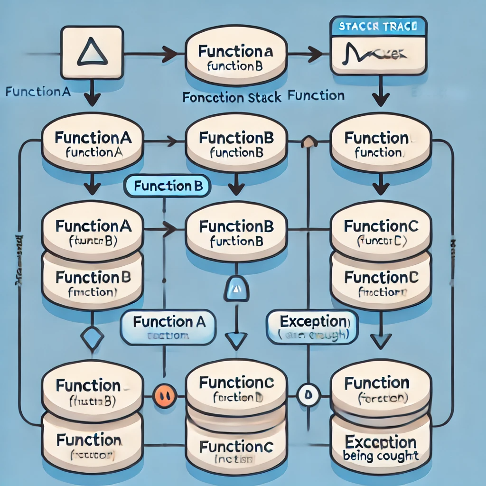

= 文件標題
:toc:
:doctype: book

== 具名函式/匿名函式

=== 具名函式（Named Functions）
具名函式是指在定義函式時給它一個名稱。這樣可以方便在程式中調用這個函式。具名函式的主要優點是可以清晰地表達函式的目的，並且可以在調試時提供堆疊跟蹤信息。

==== 定義：
[source, javascript]
----
function myFunction() {
    console.log("這是一個具名函式");
}
----

==== 使用：
[source, javascript]
----
myFunction();  // 輸出：這是一個具名函式
----

==== 優點：
* **可讀性**：具名函式通常更具可讀性，因為名稱可以描述函式的功能。
* **堆疊跟蹤**：在發生錯誤時，堆疊跟蹤會顯示具名函式的名稱，便於調試。

=== 匿名函式（Anonymous Functions）
匿名函式是指在定義時沒有給它起名稱的函式。通常，匿名函式用於一次性使用的場景，例如作為回調函式或在立即執行函式表達式（IIFE）中使用。

==== 定義：
[source, javascript]
----
const myAnonymousFunction = function() {
    console.log("這是一個匿名函式");
};
----

==== 使用：
[source, javascript]
----
myAnonymousFunction();  // 輸出：這是一個匿名函式
----

==== 在回調中的使用：
[source, javascript]
----
setTimeout(function() {
    console.log("這是一個匿名回調函式");
}, 1000);
----

==== 優點：
* **靈活性**：匿名函式可以在需要的地方直接使用，尤其是在傳遞給其他函式作為回調時。
* **簡潔性**：在簡單的場景中，不需要為函式命名，可以簡化代碼。

=== 立即執行函式表達式（IIFE）
匿名函式經常與立即執行函式表達式一起使用，這是一種在定義函式後立即執行它的方式。

==== 定義和使用：
[source, javascript]
----
(function() {
    console.log("這是一個立即執行的匿名函式");
})();  // 輸出：這是一個立即執行的匿名函式
----

=== 具名函式堆疊跟蹤
具名函式堆疊跟蹤（Named Function Stack Trace）是程式運行過程中，當發生錯誤或異常時，顯示出哪些函式依序被呼叫，直到出現問題的位置。這對於除錯非常有用，因為它可以幫助我們了解錯誤發生時的執行路徑。

[source, javascript]
----
function functionA() {
    console.log("In function A");
    functionB();
}

function functionB() {
    console.log("In function B");
    functionC();
}

function functionC() {
    console.log("In function C");
    throw new Error("Something went wrong!");
}

try {
    functionA();
} catch (error) {
    console.error("Error caught:", error);
    console.error(error.stack);
}
----

==== 解釋
* functionA 呼叫了 functionB，而 functionB 又呼叫了 functionC。
* 在 functionC 中，我們故意拋出一個錯誤 Error("Something went wrong!")。
* try-catch 塊抓取這個錯誤，並且打印出錯誤訊息和堆疊跟蹤。

==== 堆疊跟蹤輸出（範例）
[source, text]
----
Error: Something went wrong!
at functionC (index.js:12:11)
at functionB (index.js:8:5)
at functionA (index.js:4:5)
at anonymous :16:5
----

==== 堆疊跟蹤說明
* functionC 是最接近錯誤發生的函式，因此它在堆疊的頂端。
* 然後依序是 functionB 和 functionA，因為它們是呼叫 functionC 的函式。
* 最後，堆疊回到了匿名函式（即最外層的 try-catch 區塊）。

==== 圖片說明邏輯

這張圖表顯示了函式呼叫堆疊的邏輯，從 functionA 開始呼叫 functionB，然後 functionB 再呼叫 functionC。在 functionC 發生錯誤，並且最終在程式的 try-catch 區塊中捕捉到這個錯誤。

堆疊跟蹤有助於了解程式在發生錯誤時的執行流程。你可以看到每個函式被呼叫的順序，並且瞭解錯誤出現的位置。

=== 總結
* **具名函式**：有助於提高代碼的可讀性，適合重複使用的情況。
* **匿名函式**：靈活且簡潔，適合一次性使用或作為回調函式。

== Automatic Semicolon Insertion, ASI
自動插入分號 (Automatic Semicolon Insertion, ASI) 是 JavaScript 的一個特性，允許在省略分號時自動補上。這在大部分情況下能正常運作，但也有可能導致意想不到的行為。

=== 自動插入分號機制
在某些情況下，當 JavaScript 解析器遇到一行無分號的結尾時，它會嘗試自動插入分號來修正代碼。

[source, javascript]
----
// 沒有分號，JavaScript 自動插入
let a = 5
let b = 10
console.log(a + b)  // 輸出15
----
這裡，雖然每行末尾沒有分號，JavaScript 解析器會自動插入分號。

=== 自動插入分號的規則
JavaScript 會在以下情況下自動插入分號：
* 當語句以換行符結束時
* 在關鍵字 `break`, `return`, `throw` 後跟著換行符時

[source, javascript]
----
return
5 + 10
----
這段代碼會被解析為 `return;` 和 `5 + 10;`，而不是 `return 5 + 10;`。

=== 可能因 ASI 引發的錯誤
以下是一些可能因 ASI 引發錯誤的情況：

==== 返回值的問題
當 `return` 語句後面換行符出現時，可能導致無法返回預期值。
[source, javascript]
----
function calculate() {
  return 
  { value: 10 }
}
console.log(calculate())
----
這段代碼實際上會返回 `undefined`，因為 ASI 在 `return` 後插入了分號，導致 `{ value: 10 }` 被忽略。

==== 陣列與函式的錯誤
當函式結束後立即跟著開頭為 `[` 的陣列或 `(` 的括號時，可能會產生意外行為。
[source, javascript]
----
const foo = () => {}
[1, 2].forEach(console.log)
----
這裡，JavaScript 會將兩行當作兩個分離的語句，而不是一個完整的邏輯，從而導致錯誤。

==== 自增或自減運算符
在使用自增 (++) 或自減 (--) 運算符時，如果放置位置不當，ASI 可能會錯誤地插入分號。
[source, javascript]
----
let i = 10
i
++
console.log(i)
----
Compiler 會將它視為兩個獨立語句，結果 `i++` 不會如預期那樣工作，最後輸出的還是 `10`。

=== 總結
為了避免 ASI 帶來的潛在問題，開發者通常建議始終顯式地在語句末尾添加分號。這樣可以減少錯誤並提高代碼的可讀性。

== 原始型別/物件型別

=== 原始型別（Primitive Types）
原始型別是最基本的數據類型，它們是不可變的（immutable），且直接存儲其值。JavaScript 中的原始型別共有 7 種：
* **string**：表示字串，例如 "Hello"
* **number**：表示數字，包括整數和浮點數，例如 42、3.14
* **bigint**：表示任意精度的整數，例如 9007199254740991n
* **boolean**：表示布林值 true 或 false
* **undefined**：當變數已聲明但尚未賦值時，其值是 undefined
* **null**：表示空值，通常用來表示“無”的狀態
* **symbol**：用來創建唯一的標識符，例如 Symbol("unique")

==== 特點
* 不可變性：原始型別的值不能被修改，任何對其值的操作都會生成新值，而不是修改原值。
* 按值傳遞：當將原始型別賦值或傳遞給變數時，是以值的方式傳遞，也就是說它們之間互相獨立。

==== 範例
[source, javascript]
----
let numA = 10;
let numB = numA;  // numB 是 numA 的複製
numA = 20;
console.log(numB);  // 輸出 10
----
在這裡，numA 的修改不會影響 numB，因為它們各自存儲了自己的值。

==== 更多原始型別範例
[source, javascript]
----
// string 範例
let greeting = "Hello, world!";
let anotherGreeting = greeting;
greeting = "Hi!";
console.log(anotherGreeting);  // "Hello, world!"

// number 範例
let num = 10;
let anotherNum = num;
num = 20;
console.log(anotherNum);  // 10

// boolean 範例
let isTrue = true;
let anotherBool = isTrue;
isTrue = false;
console.log(anotherBool);  // true

// bigint 範例
let bigIntNum = 9007199254740991n;
let anotherBigInt = bigIntNum;
bigIntNum = bigIntNum + 1n;
console.log(anotherBigInt);  // 9007199254740991n

// symbol 範例
let sym = Symbol("unique");
let anotherSym = sym;
console.log(sym === anotherSym);  // true
----

=== 物件型別（Object Types）
物件型別是由鍵值對組成的可變集合。所有非原始型別的數據都是物件型別，包括陣列、函數、日期等。

==== 常見的物件型別
* **物件（Object）**：包含鍵值對，例如 `{ name: "John", age: 30 }`
* **陣列（Array）**：一種特殊的物件，用來存儲有序的數據列表，例如 `[1, 2, 3]`
* **函數（Function）**：也是物件類型，可以作為一等公民進行操作，例如 `function add(a, b) { return a + b; }`
* **日期（Date）**：表示日期和時間的物件類型，例如 `new Date()`
* **正則表達式（RegExp）**：表示正則表達式的物件類型，例如 `/abc/`

==== 特點
* 可變性：物件型別的值是可變的，可以在原來的基礎上修改或擴展。
* 按引用傳遞：物件型別是按引用傳遞的，這意味著如果多個變數引用同一個物件，對其中一個變數所作的改變會影響到所有引用該物件的變數。

==== 範例
[source, javascript]
----
// 物件範例
let person = { name: "Alice", age: 25 };
let anotherPerson = person;
person.name = "Bob";
console.log(anotherPerson.name);  // "Bob"
//在這裡，person 和 anotherPerson 都引用了同一個物件，因此對 person 所做的修改會影響 anotherPerson。

// 陣列範例
let arr = [1, 2, 3];
let anotherArr = arr;
arr.push(4);
console.log(anotherArr);  // [1, 2, 3, 4]

// 函數範例
function greet() {
  return "Hello!";
}
let anotherGreet = greet;
console.log(anotherGreet());  // "Hello!"

// 日期範例
let now = new Date();
let anotherDate = now;
now.setFullYear(2025);
console.log(anotherDate.getFullYear());  // 2025

// 正則表達式範例
let regex = /abc/;
let anotherRegex = regex;
console.log(anotherRegex === regex);  // true
----

=== 原始型別與物件型別的差異
[cols="3,1,1"]
|===
| 特性 | 原始型別（Primitive Types） | 物件型別（Object Types）

| 可變性
| 不可變，每次操作都返回新值
| 可變，可以直接修改屬性和方法

| 比較方式
| 比較值本身（按值比較）
| 比較引用（按引用比較）

| 存儲方式
| 直接存儲其值
| 存儲的是對象的引用地址（指向內存位置）

| 傳遞方式
| 按值傳遞，每個變數互相獨立
| 按引用傳遞，變數間共享對象

| 類型數量
| 7 種：`string`, `number`, `boolean`, `bigint`, `undefined`, `null`, `symbol`
| 無限數量，包含 `Object`、`Array`、`Function` 等
|===

==== 範例
[source, javascript]
----
// 按值比較 vs 按引用比較
let str1 = "hello";
let str2 = "hello";
console.log(str1 === str2);  // true

let obj1 = { name: "John" };
let obj2 = { name: "John" };
console.log(obj1 === obj2);  // false

// 按值傳遞 vs 按引用傳遞
let primitiveVal = 10;
function modifyPrimitive(val) {
  val = 20;
}
modifyPrimitive(primitiveVal);
console.log(primitiveVal);  // 10

let objVal = { value: 10 };
function modifyObject(val) {
  val.value = 20;
}
modifyObject(objVal);
console.log(objVal.value);  // 20
----

=== 總結
* **原始型別**：是簡單且不可變的數據類型，適合表示基礎數據。
* **物件型別**：靈活且可變，適合存儲和操作複雜的數據結構。

== 顯性轉換/隱性轉換

在 JavaScript 中，**顯性轉換（Explicit Conversion）**和**隱性轉換（Implicit Conversion）**指的是將一種資料類型轉換為另一種的過程。這兩種轉換的區別在於轉換是否是由開發者主動進行，或者是由 JavaScript 引擎自動進行。

=== 顯性轉換（Explicit Conversion）
顯性轉換是指開發者**主動**使用內建方法或運算符來將一種類型轉換為另一種類型。這是一個清晰、可控的過程，開發者確切地知道何時進行轉換。

==== 常見的顯性轉換方法

===== 轉換為數字
使用 `Number()` 函數或 `parseInt()`、`parseFloat()` 方法將其他類型的數據轉換為數字。

[source, javascript]
----
console.log(Number('123'));           // 123
console.log(Number('-123.239'));      // -123.239
console.log(Number('123abc'));        // NaN
console.log(Number(undefined));       // NaN
console.log(Number(true));            // 1
console.log(Number(false));           // 0
console.log(Number(null));            // 0
console.log(Number("1e+5"));         // 100000
console.log(Number('  '));            // 0 (whitespace is trimmed)
console.log(Number('Infinity'));      // Infinity
console.log(Number('0xF'));           // 15 (Hexadecimal conversion)
----
💡 `Number()` 的目標是判斷值是否像數字，如果像數字則轉換成功，否則為 NaN。例如 true, false, null 分別為 1, 0, 0。
邊界情況：undefined 會轉換為 NaN，空字串或空白字符會轉換為 0，十六進制字串會轉換為對應的數值。

===== `parseInt()` 和 `parseFloat()`
`parseInt()` 會將值轉換成整數，而 `parseFloat()` 保留小數。

[source, javascript]
----
console.log(parseInt('123.2'));       // 123
console.log(parseInt('123abc'));      // 123
console.log(parseInt('a'));           // NaN
console.log(parseFloat('123.239abc'));// 123.239
console.log(parseInt('100px'));       // 100
console.log(parseInt('10', 16));      // 16 (interprets as hexadecimal)
----
💡 `parseInt()` 從第一位開始判斷，遇到非數字位就停止；而 `parseFloat()` 會保留小數。
邊界情況：可以傳入進制參數給 parseInt()，非數字字符會導致停止轉換。

===== 轉換為字串
使用 `String()` 函數或 `toString()` 方法將其他類型的數據轉換為字串。

[source, javascript]
----
console.log(String(-123));            // "-123"
console.log(String(true));            // "true"
console.log((123).toString());        // "123"
console.log(String([1, 2, 3]));       // "1,2,3"
console.log(String({}));              // "[object Object]"
console.log(String(undefined));       // "undefined"
console.log(String(null));            // "null"
----
💡 `undefined` 和 `null` 不能使用 `toString()`。物件會返回 "[object Object]"，除非定義了自訂的 toString() 方法。

===== 轉換為布林值
使用 `Boolean()` 函數來將其他類型轉換為布林值。

[source, javascript]
----
console.log(Boolean(0));              // false
console.log(Boolean(''));             // false
console.log(Boolean('hello'));        // true
console.log(Boolean(undefined));      // false
console.log(Boolean([]));             // true
console.log(Boolean({}));             // true
----
💡 除了 `0`, `""`, `undefined`, `null`, `NaN`，其餘值皆為 `true`。
邊界情況：空陣列和空物件也是 `true`。

=== 隱性轉換（Implicit Conversion）
隱性轉換是指 JavaScript 在進行某些運算或操作時**自動**將一種資料類型轉換為另一種，這通常發生在運算符處理不同類型的數據時。

==== 常見的隱性轉換情況
* **字串與其他類型的相加**：當字串與數字或其他類型相加時，JavaScript 會將其他類型轉換為字串進行拼接。

[source, javascript]
----
let result = "The answer is " + 42;  // "The answer is 42"
let result2 = [1, 2, 3] + "";        // "1,2,3"
console.log([] + {});                // "[object Object]"
console.log({} + []);                // 0
----

* **數字運算中的布林值**：布林值會被轉換為數字：`true` 轉換為 1，`false` 轉換為 0。

[source, javascript]
----
let sum = true + 2;                   // 3
let difference = false - 1;           // -1
----

* **isNaN() 函數**：`isNaN()` 用來判斷值是否為「NaN」。它會隱式調用 `Number()` 來進行判斷。

[source, javascript]
----
console.log(isNaN("abc"));           // true
console.log(isNaN(undefined));        // true
console.log(isNaN("123"));           // false (implicitly converts to number)
----

* **加法運算符（+）**：當 `+` 處理字串和其他類型時，會將其他類型轉換為字串進行拼接。

[source, javascript]
----
console.log('10' + 1);                // "101"
console.log('10' - 1);                // 9
----

* **乘法與除法運算（* 和 /）**：當使用乘法或除法運算符與字串進行運算時，JavaScript 會嘗試將字串轉換為數字。無法轉換的字串會返回 NaN。

[source, javascript]
----
console.log('6' * 2);                 // 12 (string '6' is converted to number 6)
console.log('10' / 2);                // 5  (string '10' is converted to number 10)
console.log('abc' * 2);               // NaN (string 'abc' cannot be converted)
console.log('5.5' * 2);               // 11 (string '5.5' is converted to 5.5)
----

* **物件隱式轉換**：當物件與原始類型進行運算時，JavaScript 會調用物件的 `toString()` 或 `valueOf()` 方法進行隱式轉換。

[source, javascript]
----
let obj = {
  valueOf() { return 10; }
};
console.log(obj + 1);  // 11
----

=== 顯性轉換 vs 隱性轉換
[cols="3,1,1"]
|===
| 特點 | 顯性轉換 | 隱性轉換

| 誰發起轉換
| 開發者明確進行
| JavaScript 引擎自動進行

| 轉換的控制
| 完全控制
| 無法控制，取決於上下文

| 轉換方式
| 使用明確的方法如 `Number()`, `String()`
| 發生於運算符、比較、條件運算時

| 示例
| `Number('123')` 明確將字串轉數字
| `'123' - 1` 自動將字串轉換為數字

| 潛在問題
| 可預期，易於調試
| 隱式轉換有時會導致意外的結果，如字串拼接或布林轉換

| 性能
| 轉換有具體步驟，略微增加計算負擔
| 依賴 JavaScript 引擎處理，通常較快但難以預料
|===

=== 隱性轉換的常見問題
隱性轉換有時會導致意外的行為，特別是在比較和運算時。例如：

* `+` 和 `-` 的不同處理：`+` 用於字串拼接，而 `-` 會進行數字轉換。

[source, javascript]
----
let result = "10" + 1;               // "101"
let result2 = "10" - 1;              // 9
----

* **BigInt 和 Symbol**：BigInt 不能與其他原始類型混合運算，必須顯性轉換。Symbol 也無法與其他類型進行運算。

[source, javascript]
----
console.log(1 + 1n);                  // Uncaught TypeError: Cannot mix BigInt and other types
console.log(1 + Symbol("1"));         // Uncaught TypeError: Cannot convert a Symbol value to a number
----

* **NaN 的處理**：任何與 NaN 進行的運算都會返回 NaN。

[source, javascript]
----
console.log(NaN + 5);                 // NaN
console.log("abc" - 1);               // NaN
----

== 型別比較
在 JavaScript 中，型別比較（type comparison）是經常遇到的問題，因為 JavaScript 是動態型別語言，因此變數的型別可以在運行時期改變。JavaScript 提供了兩種主要的比較運算符：

=== 寬鬆比較（Loose Equality）：==
使用 == 進行比較時，JavaScript 會嘗試在比較前進行類型轉換，這意味著即使變數的類型不同，也可能返回 true。

[source, javascript]
----
console.log(5 == '5');  // true
console.log(0 == false); // true
console.log(null == undefined); // true
----

==== 規則
* JavaScript 會自動將不同類型的數據轉換為相同類型再進行比較。
* 字符串和數字會轉換為數字比較。
* null 和 undefined 被視為相等。
* false 會被轉換為 0，true 會被轉換為 1。

==== 問題
* 由於自動型別轉換，這種比較有時會導致意想不到的結果。因此，通常不推薦使用。

=== 嚴格比較（Strict Equality）：===
使用 === 進行比較時，JavaScript 會不進行類型轉換，這意味著變數的類型和值必須完全相同才能返回 true。

[source, javascript]
----
console.log(5 === '5');  // false
console.log(0 === false); // false
console.log(null === undefined); // false
----

==== 規則
* 如果兩個值的類型不同，直接返回 false。
* 必須在類型和值都相等的情況下，才會返回 true。

==== 優點
* 避免自動型別轉換的混淆。
* 更加明確和可預測，適合大多數比較情境。

=== 其他比較方法
`Object.is()` 用於比較兩個值是否相同，與 === 大致相同，但處理一些特殊值（如 NaN 和 -0）的方式不同。

[source, javascript]
----
console.log(Object.is(NaN, NaN));      // true
console.log(NaN === NaN);              // false
console.log(Object.is(+0, -0));         // false
----

=== 使用場景
* **=== 嚴格比較**：在大多數情況下，應該使用 ===，因為它更加安全和清晰。
* **== 寬鬆比較**：當你確實需要進行不同類型之間的比較，並且希望 JavaScript 自動進行類型轉換時，才考慮使用。

=== 常見陷阱
* null 和 undefined 在 == 下相等，但在 === 下不相等。
* NaN 與任何值都不相等，包括它自己，所以比較 NaN 值時應使用 isNaN() 或 Object.is()。

=== 各種型別比較範例
==== 陣列
[source, javascript]
----
let arr1 = [1, 2, 3];
let arr2 = [1, 2, 3];
let arr3 = arr1;

console.log(arr1 == arr2);   // false （不同的物件引用）
console.log(arr1 === arr2);  // false （不同的物件引用）
console.log(arr1 === arr3);  // true  （引用同一個物件）

console.log([1, 2] == [1, 2]);   // false （不同的物件引用）
console.log([1, 2] === [1, 2]);  // false
----

==== 物件
[source, javascript]
----
let obj1 = { a: 1 };
let obj2 = { a: 1 };
let obj3 = obj1;

console.log(obj1 == obj2);   // false （不同的物件引用）
console.log(obj1 === obj2);  // false （不同的物件引用）
console.log(obj1 === obj3);  // true  （引用同一個物件）
----

==== Infinity 和 -Infinity
[source, javascript]
----
console.log(Infinity == Infinity);   // true
console.log(Infinity === Infinity);  // true
console.log(Infinity > 999999999);   // true

console.log(-Infinity == -Infinity); // true
console.log(-Infinity === -Infinity);// true
console.log(-Infinity < -999999999); // true
----

==== Symbol
[source, javascript]
----
let sym1 = Symbol('foo');
let sym2 = Symbol('foo');

console.log(sym1 == sym2);   // false （每個 Symbol 都是唯一的）
console.log(sym1 === sym2);  // false
----

==== BigInt 和 Number

[source, javascript]
----
let bigInt1 = BigInt(1);
let num1 = 1;

console.log(bigInt1 == num1);    // true  （寬鬆比較，會將 BigInt 和 Number 視為相等）
console.log(bigInt1 === num1);   // false （嚴格比較，不同型別）

console.log(1n === 1);  // false  （BigInt 與 Number 嚴格比較不同）
console.log(1n == 1);   // true   （BigInt 與 Number 寬鬆比較相同）
----

=== 6. 總結

* 使用 `===` 進行嚴格比較可以避免 JavaScript 自動進行型別轉換時帶來的潛在錯誤。
* `==` 可以依照業務需求特性使用。
* 在處理物件、陣列等複雜型別時，必須注意引用的相同與否，而不僅僅是值的相同。

[.sub]
====
[role="pageclick"]
<<index.html, 上一頁>> | <<index.html, 回目錄>> | <<function.html, 下一頁>>
