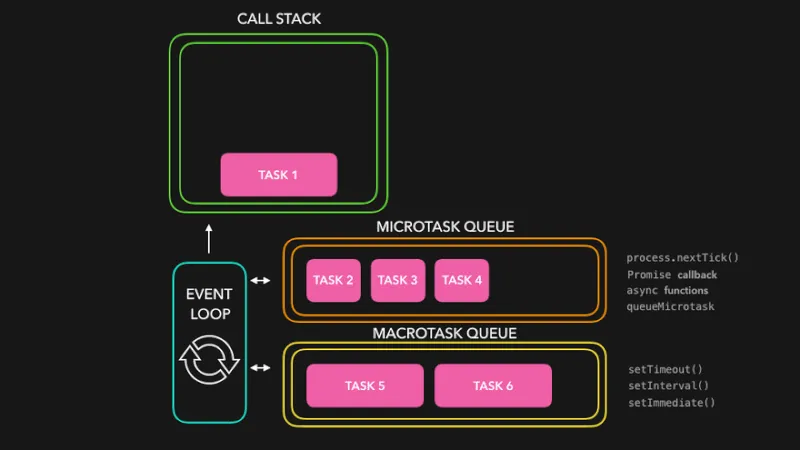
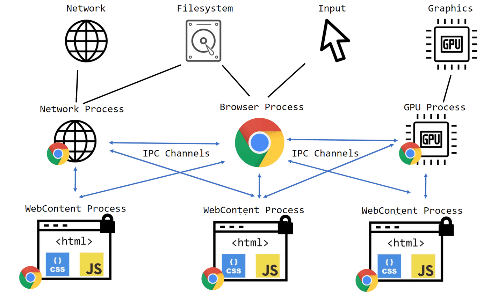

= JavaScript 報告

== 目錄
- 第一組(語法及型別)
* link:#具名函式匿名函式[具名函式/匿名函式]
* link:#automatic-semicolon-insertion-asi[Automatic Semicolon Insertion, ASI]
* link:#原始型別物件型別[原始型別/物件型別]
* link:#顯性轉換隱性轉換[顯性轉換/隱性轉換]
* link:#型別比較[型別比較]

- 不分組
* link:#iife-與-高階函式[函式(IIFE 與 高階函式)]
* link:#函式閉包this箭頭函式[函式(閉包、this、箭頭函式)]
* link:#非同步同步非同步差異xmlhttprequestfetchajaxpromise[非同步(同步/非同步差異、XMLHttpRequest/fetch、AJAX、Promise)]
* link:promise-與非同步處理[非同步(async/await、try…​catch 與非同步)]

== 具名函式/匿名函式

=== 1. 具名函式（Named Functions）

具名函式是指在定義函式時給它一個名稱。這樣可以方便在程式中調用這個函式。具名函式的主要優點是可以清晰地表達函式的目的，並且可以在調試時提供堆疊跟蹤信息。

==== 定義：

[source,javascript]
----
function myFunction() {
    console.log("這是一個具名函式");
}
----

==== 使用：

[source,javascript]
----
myFunction();  // 輸出：這是一個具名函式
----

通常具名函式用於有個相同的功能需要被重複被使用的，或是想將複雜的邏輯拆解的情況，
比如現在要寫一個點擊button後，根據input內的值回傳對應的結果。
在沒有使用具名方法的情況，若之後有越來越多的 button，程式會越來越難維護。

[source,javascript]
----
//  button1
document.getElementById("button1").addEventListener("click",function() {
    let value = document.getElementById("input2").value;
    console.log(value);
})

// button2
document.getElementById("button2").addEventListener("click",function() {
    let value = document.getElementById("input2").value;
    console.log(value);
})
----

這時候將重複的程式碼內容取出寫成方法，可以看到程式碼變得比較簡單易懂一些，就
算今天有5個button要監聽，也比沒有用的情況好理解一點。重點是未來要修改時，
只需要修改 function 本身就可以一次性修改所有 button 的監聽事件

[source,javascript]
----
/**
 * 添加監聽，並印出 input 的 value
 * @param button 要監聽的button id
 * @param input 要讀取的input id
 */
function getValueAndConsole(button, input) {
    document.getElementById(button).addEventListener("click",function() {
        let value = document.getElementById(input).value;
        console.log(value);
    })
}

getValueAndConsole("button1", "input1");
getValueAndConsole("button2", "input2");
----

==== 優點：

* *可讀性*：具名函式通常更具可讀性，因為名稱可以描述函式的功能。
* *模組化*： 可以讓程式更易於拆分為可重用的模組，每個函式都有明確的名稱和功能，促進代碼的組織性和維護性
* *堆疊跟蹤*：在發生錯誤時，堆疊跟蹤會顯示具名函式的名稱，便於調試。

=== 2. 匿名函式（Anonymous Functions）

匿名函式是指在定義時沒有給它起名稱的函式。通常，匿名函式用於一次性使用的場景，例如作為回調函式或在立即執行函式表達式（IIFE）中使用。

==== 定義：

[source,javascript]
----
const myAnonymousFunction = function() {
console.log("這是一個匿名函式");
};
----

==== 使用：

[source,javascript]
----
myAnonymousFunction();  // 輸出：這是一個匿名函式
----

==== 在回調中的使用：

[source,javascript]
----
setTimeout(function() {
console.log("這是一個匿名回調函式");
}, 1000);
----

==== 優點：

* *靈活性*：匿名函式可以在需要的地方直接使用，尤其是在傳遞給其他函式作為回調時。
* *簡潔性*：在簡單的場景中，不需要為函式命名，可以簡化代碼。

==== 3. 立即執行函式表達式（IIFE）

匿名函式經常與立即執行函式表達式一起使用，這是一種在定義函式後立即執行它的方式。

==== 定義和使用：

[source,javascript]
----
(function() {
console.log("這是一個立即執行的匿名函式");
})();  // 輸出：這是一個立即執行的匿名函式
----

=== 4. 具名函式堆疊跟蹤

具名函式堆疊跟蹤（Named Function Stack Trace）是程式運行過程中，當發生錯誤或異常時，顯示出哪些函式依序被呼叫，直到出現問題的位置。這對於除錯非常有用，因為它可以幫助我們了解錯誤發生時的執行路徑。

[source, javascript]
----
function functionA() {
    console.log("In function A");
    functionB();
}

function functionB() {
    console.log("In function B");
    functionC();
}

function functionC() {
    console.log("In function C");
    throw new Error("Something went wrong!");
}

try {
    functionA();
} catch (error) {
    console.error("Error caught:", error);
    console.error(error.stack);
}
----

==== 解釋

* 1. `functionA` 呼叫了 `functionB`，而 `functionB` 又呼叫了 `functionC`。
* 2. 在 `functionC` 中，我們故意拋出一個錯誤 `Error("Something went wrong!")`。
* 3. `try-catch` 塊抓取這個錯誤，並且打印出錯誤訊息和堆疊跟蹤。

==== 堆疊跟蹤輸出（範例）

當運行這個程式時，輸出的堆疊跟蹤可能看起來像這樣：

[source, text]
----
Error: Something went wrong!
at functionC (index.js:12:11)
at functionB (index.js:8:5)
at functionA (index.js:4:5)
at anonymous :16:5
----

==== 堆疊跟蹤說明

* `functionC` 是最接近錯誤發生的函式，因此它在堆疊的頂端。
* 然後依序是 `functionB` 和 `functionA`，因為它們是呼叫 `functionC` 的函式。
* 最後，堆疊回到了匿名函式（即最外層的 `try-catch` 區塊）。

==== 圖片說明邏輯

image::../images/Stack.png[]

這張圖表顯示了函式呼叫堆疊的邏輯，從 `functionA` 開始呼叫 `functionB`，然後 `functionB` 再呼叫 `functionC`。在 `functionC` 發生錯誤，並且最終在程式的 `try-catch` 區塊中捕捉到這個錯誤。

堆疊跟蹤有助於了解程式在發生錯誤時的執行流程。你可以看到每個函式被呼叫的順序，並且瞭解錯誤出現的位置。

=== 總結

* *具名函式*：有助於提高代碼的可讀性，適合重複使用的情況。
* *匿名函式*：靈活且簡潔，適合一次性使用或作為回調函式。

== Automatic Semicolon Insertion, ASI

自動插入分號 (Automatic Semicolon Insertion, ASI) 是 JavaScript 的一個特性，允許在省略分號時自動補上。這在大部分情況下能正常運作，但也有可能導致意想不到的行為。

=== 自動插入分號機制

在某些情況下，當 JavaScript 解析器遇到一行無分號的結尾時，它會嘗試自動插入分號來修正代碼。

[source, javascript]
----
let a = 5
let b = 10
console.log(a + b)
//輸出15
----

這裡，雖然每行末尾沒有分號，JavaScript 解析器會自動插入分號。

=== 自動插入分號的規則

JavaScript 會在以下情況下自動插入分號：

* 當語句以換行符結束時
* 在關鍵字 `break`, `return`, `throw` 後跟著換行符時

[source, javascript]
----
return
5 + 10
----

這段代碼會被解析為 `return;` 和 `5 + 10;`，而不是 `return 5 + 10;`。

=== 可能因 ASI 引發的錯誤

以下是一些可能因 ASI 引發錯誤的情況：

==== 1. 返回值的問題

當 `return` 語句後面換行符出現時，可能導致無法返回預期值。

[source, javascript]
----
function calculate() {
  return 
  { value: 10 }
}
console.log(calculate())
----

這段代碼實際上會返回 `undefined`，因為 ASI 在 `return` 後插入了分號，導致 `{ value: 10 }` 被忽略。

==== 2. 陣列與函式的錯誤

當函式結束後立即跟著開頭為 `[` 的陣列或 `(` 的括號時，可能會產生意外行為。

[source, javascript]
----
const foo = () => {}
[1, 2].forEach(console.log)
----

這裡，JavaScript 會將兩行當作兩個分離的語句，而不是一個完整的邏輯，從而導致錯誤。

==== 3. 自增或自減運算符

在使用自增 (++) 或自減 (--) 運算符時，如果放置位置不當，ASI 可能會錯誤地插入分號。

[source, javascript]
----
let i = 10
i
++
console.log(i)
----

Compiler 會將它視為兩個獨立語句，結果 `i++` 不會如預期那樣工作，最後輸出的還是 `10`。

=== 總結

為了避免 ASI 帶來的潛在問題，開發者通常建議始終顯式地在語句末尾添加分號。這樣可以減少錯誤並提高代碼的可讀性。

=== JavaScript 同步與非同步

==== 目錄

* <<sync_async_concept,同步與非同步概念>>
  ** <<what_is_sync,同步是什麼？>>
  ** <<what_is_async,非同步是什麼？>>
  ** <<why_need_async,為什麼需要非同步>>
  ** <<why_async,為什麼 JavaScript 可以非同步？>>

* <<ajax_requests,AJAX 與數據請求>>
  ** <<what_is_ajax,什麼是 AJAX?>>
  ** <<what_is_xmlhttprequest,XMLHttpRequest>>
  ** <<what_is_fetch,Fetch>>
  ** <<xmlhttprequest_vs_fetch,XMLHttpRequest vs. Fetch>>

* <<promise_async_handling,Promise 與非同步處理>>
  ** <<what_is_promise,Promise>>
    *** <<promise_states,Promise 的狀態>>
    *** <<promise_structure,Promise 的基本結構>>
    *** <<promise_chain_structure,Promise 的鏈式結構>>
    *** <<promise_flexibility,Promise 的靈活應用>>
      **** <<promise_all,Promise.all()>>
        ***** <<promise_all_example,Promise.all() 實際範例>>
      **** <<promise_allsettled,Promise.allSettled()>>
        ***** <<promise_allsettled_example,Promise.allSettled() 實際範例>>
      **** <<promise_race,Promise.race()>>
        ***** <<promise_race_example,Promise.race() 實際範例>>
      **** <<promise_any,Promise.any()>>
        ***** <<promise_any_example,Promise.any() 實際範例>>
  ** <<promise_methods_comparison,Promise 方法比較>>

[id=sync_async_concept]
=== 同步與非同步概念

[id=what_is_sync]
==== 同步是什麼？

「同步」指的是一次只能做一件事情。

JavaScript 是「單執行緒 (Single-Thread)」語言，這意味著它一次只能執行一個任務。所有操作都會按順序執行，這是同步的概念。

[source,javascript]
----

// Synchronous code example
console.log("Start");

console.log("Performing a synchronous task");

console.log("End");

----
[id=what_is_async]
==== 非同步是什麼？

非同步允許多個任務並行進行，無需等待前一個任務完成。非同步處理讓 JavaScript 可以在不阻塞主線程的情況下處理耗時操作，比如網絡請求或定時器。

[source,javascript]
----

console.log("hello");
setTimeout(function() {
    console.log("End");
}, 1000);

for(let i = 0; i < 4; i++) {
    console.log(i);
}

----

在這個例子中，#setTimeout# 是一個非同步操作，並不會阻塞 JavaScript 執行其他代碼。即使我們指定它在 1000 毫秒後執行，但 JavaScript 會繼續執行後續的 #for# 迴圈，而不必等待 #setTimeout# 完成。

[id=why_need_async]
=== 為什麼需要非同步？什麼時候會用到？

==== Blocking

阻塞（blocking） 是指程式在執行某個操作時，必須等待該操作完成，才能繼續執行後續的程式碼。在阻塞過程中，程式的執行會暫停，等待某個資源或操作完成，這段時間內，其他操作無法進行。這通常發生在某些需要較長時間才能完成的操作上，比如以下：

* *向 API 發送請求*：若是同步處理，JavaScript 在等待 API 回應時，頁面會被鎖住，什麼操作都無法進行。

* *setTimeout*：定時器如果是同步的，則必須等待時間結束，其他代碼無法執行。

* *DOM 操作*：若是同步處理，則在操作 DOM 的過程中，整個頁面無法進行其他交互。

為了避免這些阻塞問題，JavaScript 引入了非同步機制，讓長時間執行的任務可以在後台進行，並在完成後通知主執行線程。

=== link:../html/blocking-demo.html[點擊這裡操作頁面以了解阻塞概念]

[id=why_async]
=== 為什麼 JavaScript 可以非同步？

雖然 JavaScript 是單執行緒語言，但它可以透過與瀏覽器的 Web API 進行互動，實現非同步處理。這樣，JavaScript 本身依然是同步的，但透過 Web API 它能夠並行處理多個任務，而不會阻塞主線程。

這些 Web API（例如：#setTimeout#、#XMLHttpRequest#、#fetch#）允許瀏覽器代為處理異步操作，並在任務完成後將結果傳回 JavaScript 引擎。

==== JavaScript 的執行機制

為了理解 JavaScript 是如何處理非同步操作的，我們需要了解它的執行機制，主要包括以下幾個部分：

* *Call Stack (調用堆疊)*：JavaScript 執行同步代碼時，會依次將函數推入調用堆疊，並從堆疊中彈出執行完成的函數。

* *Web API* : Web API 是由瀏覽器提供的，專門用來處理異步操作。當 JavaScript 遇到像 #setTimeout# 或 #fetch# 這樣的異步操作時，會將它們委託給 Web API 處理，並繼續執行其他同步代碼。

* *Callback Queue (回調隊列)*：當 Web API 完成異步操作後，會將回調函數放入回調隊列，等待主線程空閒時執行。

* *Microtask Queue (微任務隊列)*：這是專門用來處理更高優先級的任務，比如 #Promise# 的回調。微任務在每次事件循環結束後會立即執行。

* *Macrotask Queue (宏任務隊列)*：宏任務包括 #setTimeout# 和 #setInterval# 等異步操作。這些任務的回調會在微任務執行完畢後執行。

[cols="2*a", frame="none", grid="none"]
|===
|image::../images/micro-task.png[scaledwidth=50%]
|image::../images/macro-task.png[scaledwidth=50%]
|===

==== 事件循環 (Event Loop)

JavaScript 使用「事件循環 (Event Loop)」來協調這些任務。事件循環會不斷檢查調用堆疊是否為空，如果為空，就會從回調隊列中取出任務執行，從而實現非同步操作。

==== 完整執行流程

完整的非同步執行流程如下：

* JavaScript 將同步代碼推入 Call Stack 執行。

* 當遇到異步操作時，將其交給 Web API 處理，並繼續執行其他代碼。

* Web API 完成任務後，將回調函數放入 Callback Queue 裡的 Macrotask Queue 或 Microtask Queue 中。

* 事件循環檢查 Call Stack 是否空閒，若空閒則依次處理回調隊列中的回調。

* Microtask Queue 會優先於 Macrotask Queue 執行。

==== 例子展示非同步運作

[source,javascript]
----

console.log("Start");

setTimeout(() => {
    console.log("Timeout callback");
}, 1000);

Promise.resolve().then(() => {
    console.log("Promise callback");
});

console.log("End");

// 這段代碼會輸出：
// Start
// End
// Promise callback
// Timeout callback

----

Promise 的回調會進入微任務隊列（Microtask Queue），而 #setTimeout# 的回調則進入宏任務隊列（Macrotask Queue）。微任務會優先執行，因此 Promise 的回調會在 #setTimeout# 之前執行。

=== link:http://latentflip.com/loupe/?code=JC5vbignYnV0dG9uJywgJ2NsaWNrJywgZnVuY3Rpb24gb25DbGljaygpIHsKICAgIHNldFRpbWVvdXQoZnVuY3Rpb24gdGltZXIoKSB7CiAgICAgICAgY29uc29sZS5sb2coJ1lvdSBjbGlja2VkIHRoZSBidXR0b24hJyk7ICAgIAogICAgfSwgMjAwMCk7Cn0pOwoKY29uc29sZS5sb2coIkhpISIpOwoKc2V0VGltZW91dChmdW5jdGlvbiB0aW1lb3V0KCkgewogICAgY29uc29sZS5sb2coIkNsaWNrIHRoZSBidXR0b24hIik7Cn0sIDUwMDApOwoKY29uc29sZS5sb2coIldlbGNvbWUgdG8gbG91cGUuIik7!!!PGJ1dHRvbj5DbGljayBtZSE8L2J1dHRvbj4%3D[🎥 *點擊這裡查看完整的事件循環可視化演示*]

[id=ajax_requests]
=== AJAX 與數據請求

[id=what_is_ajax]
==== 什麼是 AJAX?

AJAX（Asynchronous
link:https://developer.mozilla.org/zh-TW/docs/Glossary/JavaScript[JavaScript]
And
link:https://developer.mozilla.org/en-US/docs/Glossary/XML[XML]
，非同步 JavaScript 與 XML）是結合了
link:https://developer.mozilla.org/zh-TW/docs/Glossary/HTML[HTML]
、
link:https://developer.mozilla.org/zh-TW/docs/Glossary/CSS[CSS]
、JavaScript、
link:https://developer.mozilla.org/zh-TW/docs/Glossary/DOM[DOM]
、還有 #XMLHttpRequest# 物件，以建立更複雜的網頁應用。AJAX
允許網頁只更新所需的部分，而無需重新載入整個頁面。雖然名字中有
XML，但它也可以用現今廣泛使用的 JSON 及其他資料類型（如 HTML, Form
Data, Binary Data, Blob, ArrayBuffer）進行資料交換。

[id=what_is_xmlhttprequest]
=== XMLHttpRequest

XMLHttpRequest 是 JavaScript 中的物件，允許網頁向伺服器發送 HTTP
或 HTTPS
請求，並在不重新載入整個網頁的情況下接收回應資料。這項技術是實現
AJAX 的重要組成部分，能讓網頁內容動態更新。雖然現在常用 fetch()
技術，但 XMLHttpRequest 在某些較舊的項目中仍然被廣泛使用。

==== XMLHttpRequest 基本概念

====== 1. 建立 XMLHttpRequest 物件
[source,javascript]
----
let xhr = new XMLHttpRequest();
----

0
此時仍為同步語句，非同步操作尚未開始
物件創建：創建了一個新的XMLHttpRequest物件
記憶體分配：xhr物件被分配在記憶體的Heap中
初始狀態：此時xhr.readyState的值為0，表示UNSENT

0readyState 狀態值：

* 0: UNSENT – 請求尚未打開。

* 1: OPENED – 請求已打開，但尚未發送。

* 2: HEADERS_RECEIVED – 已收到伺服器回應標頭。

* 3: LOADING – 請求正在處理，回應的資料正在接收。

* 4: DONE – 請求已完成，回應可用。

====== 2. 打開請求 (open)

[source,javascript]
----

xhr.open('GET', 'https://api.example.com/data', true);
----

該方法初始化了一個HTTP請求，只聽了請求方法與URL，第三個參數為true表示非同步
此時xhr.readyState的值變為1
調用 `open()` 方法僅僅是設定請求參數，還沒開始網路通訊

====== 3. 發送請求 (send)

[source,javascript]
----
xhr.send();
----

如果是 POST 請求，可以將資料以字串格式傳入 send() 中：

[source,javascript]
----

let data = JSON.stringify({ name: "Oscar", age: 24 });
xhr.send(data);
----

*此時瀏覽器做了什麼？*

一、準備發送請求

. 檢查 XMLHttpRequest 物件的狀態 +
確認狀態為已初始化：確保已經調用了 `open()` 方法，`readyState` 為 1（OPENED）。
確認請求已設定：請求方法、URL、同步或非同步步標誌等已正確設置。

. 處理Request Headers +
應用預設的Request Headers：如 Accept、User-Agent 等。
應用開發者設置的Request Headers：如果在調用 `send()` 之前使用 `setRequestHeader()` 設置了自定義的 Request Headers，
這些Headers會在請求中被包含。

. Request Body +
處理Request Body數據：如果請求方法為 POST、PUT 等，並且在 `send()` 方法中傳入了Request Body，瀏覽器會對數據進行適當的編碼
（如將 JavaScript 物件轉換為 JSON 字符串）。

二、發送網路請求

. 開始網路通訊 +
委派給Network Thread：瀏覽器將網路請求交給Network Thread處理，以避免阻塞Main Thread（JavaScript 執行環境）。
建立連接：如果與目標伺服器之間沒有現有的連接，瀏覽器會建立一個新的 TCP 連接，可能會進行 DNS 查詢、TLS 握手等。

. 發送 HTTP 請求 +
構建 HTTP 請求：將請求方法、URL、HTTP 版本、Request header和Request Body組合成完整的 HTTP 請求報文。
發送請求報文：通過網路將請求報文發送給目標伺服器。

三、處理請求過程中的事件

. 更新 readyState +
readyState 變化：請求發送後，readyState 仍為 1。隨著請求的進展，readyState 會發生1~4的變化：

. 觸發事件處理器 +
onreadystatechange 事件：每當 readyState 發生變化時，瀏覽器會調用 onreadystatechange 回調函數。

四、接收Response

. 收到Response Header +
狀態碼和狀態文本：瀏覽器接收到伺服器的Response Header，獲取 HTTP 狀態碼（如 200、404）和狀態文本（如 OK、Not Found）。
Response Header資訊：獲取伺服器返回的Response Header，如 Content-Type、Content-Length、Set-Cookie 等。

. 更新 readyState 為 2 +
觸發 onreadystatechange：readyState 變為 2，觸發 onreadystatechange 回調。
. 接收Response 體
數據流接收：瀏覽器開始接收Response 體數據，這個過程可能是漸進式的，特別是對於大型文件。
更新 readyState 為 3：
觸發 onreadystatechange：readyState 變為 3，表示正在接收Response 體，觸發 onreadystatechange 回調。
觸發 onprogress：在接收過程中，多次觸發 onprogress 事件，可用於更新下載進度。

. 接收完成 +
更新 readyState 為 4：
readyState 變為 4（DONE），表示Response 已完整接收。
觸發 onreadystatechange：最後一次調用 onreadystatechange 回調。
觸發 onload 或 onerror：
如果請求成功（HTTP 狀態碼為 2xx 或 3xx），觸發 onload 事件。
如果請求失敗（如網路錯誤、超時等），觸發 onerror 事件。

*瀏覽器的內部機制與Thread*

. Main Thread +
JavaScript 執行：Main Thread負責執行所有的 JavaScript 程式碼，包括調用 send() 方法的程式碼。
事件循環：Main Thread負責處理事件循環，調度Task Queue中的任務。

. Network Thread +
網路請求處理：當調用 send() 方法時，網路請求被委派給瀏覽器的Network Thread，以非阻塞的方式處理。
數據接收：Network Thread負責接收伺服器的Response ，並將相關事件（如 onreadystatechange）添加到Main Thread的Task Queue中。

. 任務調度 +
Event Loop：Main Thread的事件循環負責調度任務，當Network Thread接收到數據並觸發事件時，這些事件的回調函數會被添加
到Task Queue，等待Main Thread執行。
非阻塞：由於網路請求在Network Thread中處理，Main Thread可以繼續執行其他程式碼，不會因為等待網路請求而被阻塞。

----
調用 xhr.send()
 |
 V
 瀏覽器檢查請求設定並準備請求
 |
 V
瀏覽器委派網路請求給Network Thread
 |
 V
Network Thread處理網路通訊，發送請求
 |
 V
請求發出後，Main Thread繼續執行後續程式碼
 |
 V
Network Thread接收Response ，更新 readyState
 |
 V
觸發對應的事件（如 onreadystatechange），添加到Main Thread的Task Queue
 |
 V
Main Thread的事件循環調度並執行回調函數
 |
 V
 在回調函數中處理Response 數據，更新頁面等

----

====== 4. 處理回應 (response)

可以透過 #onreadystatechange# 或
#onload# 監聽請求的狀態變化並處理回應：

[source,javascript]
----

xhr.onreadystatechange = function() {
    if (xhr.readyState === 4 && xhr.status === 200) {
        console.log(xhr.responseText); // 輸出伺服器回應的資料
    }
};
----

[source,javascript]
----

xhr.onload = function() {
    if (xhr.status >= 200 && xhr.status < 300) {
        console.log(xhr.responseText); // 處理回應資料
    } else {
        console.error('請求失敗');
    }
};
----

=== Fetch

[id=what_is_fetch]
==== 什麼是 Fetch？

*Fetch API* 是
*XMLHttpRequest* 的現代替代品。它使用
*Promise* 來處理非同步操作，設計更加靈活且簡潔。

[source,javascript]
----

fetch('https://api.example.com/products')
.then(response => {
    if (!response.ok) {
        throw new Error('網路回應有誤：' + response.statusText);
    }
    return response.json();// 解析 JSON 資料
})
.then(products => {
    console.log(products);// 處理並顯示產品
})
.catch(error => {
    console.error('Fetch 操作中出現問題：', error);
});
----

==== 使用 Fetch 發送 POST 請求

假設用戶將產品加入購物車，可以使用 Fetch 發送 POST 請求：

[source,javascript]
----

fetch('https://api.example.com/cart', {
    method: 'POST',
    headers: {
    'Content-Type': 'application/json'
    },
    body: JSON.stringify({
        productId: 12345,
        quantity: 1
    })
})
.then(response => response.json())
.then(data => console.log('產品已加入購物車：', data))
.catch(error => console.error('加入購物車時發生錯誤：', error));
----

[id=xmlhttprequest_vs_fetch]
==== XMLHttpRequest vs. Fetch

===== XMLHttpRequest 範例：

[source,javascript]
----

var xhr = new XMLHttpRequest();
xhr.open('GET', 'https://api.example.com/data', true);
xhr.onload = function() {
    if (xhr.status >= 200 && xhr.status < 300) {
        var data = JSON.parse(xhr.responseText);
        console.log(data);
    } else {
        console.error('Error:', xhr.statusText);
    }
};
xhr.onerror = function() {
    console.error('Request failed');
};
xhr.send();

----

==== Fetch 範例：

[source,javascript]
----

fetch('https://api.example.com/data')
.then(response => response.json())
.then(data => console.log(data))
.catch(error => console.error('Error:', error));
----
[cols="1,1,1", options="header", frame="all", grid="all"]
|===
| 比較 | Fetch API | XMLHttpRequest

| *語法和易用性*
| - 基於 Promise，語法更簡潔 +
  - 更易於閱讀和維護
| - 基於回調函數，語法較為繁瑣 +
  - 需要處理多個事件

| *非同步處理方式*
| - 使用 Promise +
  - 支持 `async/await` 語法
| - 使用事件和回調函數 +
  - 不支援 Promise

| *同步請求*
| - 不支持同步請求
| - 支持同步請求（但已被廢棄，不推薦使用）

| *請求攔截和取消*
| - 支持使用 `AbortController` 取消請求
| - 可使用 `xhr.abort()` 方法取消請求

| *請求進度監聽*
| - 無法直接監聽請求進度 +
  - 不支援上傳進度監聽
| - 支持 `onprogress` 事件 +
  - 可監聽下載和上傳進度

| *錯誤處理*
| - 只有在網絡錯誤時會拒絕 Promise +
  - HTTP 錯誤（如 404、500）不會拋出錯誤，需要手動檢查 `response.ok`
| - 可通過 `xhr.status` 判斷 HTTP 狀態碼 +
  - 在錯誤時觸發 `onerror` 事件

| *Response 類型*
| - 支持多種 Response 類型，如 `response.json()`、`response.text()`、`response.blob()`、`response.arrayBuffer()`、`response.formData()`
| - Response 存儲在 `responseText`（字符串）和 `responseXML`（XML 文檔）中

| *Request header 設置*
| - 使用 `Headers` 物件設置 Request header +
  - 某些頭部不可修改（如 `Referer`、`User-Agent`）
| - 使用 `setRequestHeader()` 方法設置 Request header +
  - 可以設置更多自定義頭部

| *跨域請求（CORS）*
| - 默認採用 CORS +
  - 支持跨域請求，但需要伺服器允許
| - 需要額外設定才能進行跨域請求 +
  - 可能受到更多限制

| *流式處理*
| - 支持流式 Response（Streaming） +
  - 可逐步處理大型數據
| - 不支持流式 Response +
  - 必須在 Response 完全接收後才能處理

| *請求取消（Abort）*
| - 支持使用 `AbortController` 取消請求
| - 可使用 `xhr.abort()` 方法取消請求

| *超時設置*
| - 不直接支持超時設置 +
  - 需要使用 `Promise.race()` 實現超時控制
| - 支持 `xhr.timeout` 屬性設置超時時間 +
  - 可監聽 `ontimeout` 事件

| *上傳文件*
| - 支持通過 `fetch` 上傳文件 +
  - 但無法監聽上傳進度
| - 支持上傳文件 +
  - 可通過 `xhr.upload.onprogress` 監聽上傳進度

| *自動發送 Cookie*
| - 默認不發送 Cookie +
  - 需要設置 `credentials` 選項 +
  - `credentials: 'same-origin'` 或 `credentials: 'include'`
| - 默認會發送並接收 Cookie +
  - 可通過 `withCredentials` 屬性控制

| *HTTP Response 碼處理*
| - 需要手動檢查 `response.ok` 或 `response.status` 來判斷是否成功
| - 可直接通過 `xhr.status` 判斷請求是否成功

| *原生支援度*
| - 現代瀏覽器原生支持 +
  - IE 不支持 Fetch API，需要使用 polyfill
| - 所有主流瀏覽器均支持，包括較舊版本的 IE

| *調試和追蹤*
| - 調試較為困難，錯誤信息可能不夠詳細
| - 調試較為方便，可在開發者工具中查看請求詳細信息

| *HTTP 改寫或重導向*
| - `fetch` 會自動處理 HTTP 重導向 +
  - 可設置 `redirect` 選項控制
| - 需要手動處理重導向，較為麻煩

| *安全性*
| - 遵循嚴格的 CORS 政策 +
  - 某些頭部不可修改，增強安全性
| - 可能存在被利用的風險，需要謹慎處理

| *使用場景*
| - 適合現代化的應用開發 +
  - 需要處理 Promise 的情況
| - 適合需要兼容舊瀏覽器 +
  - 需要監聽進度或同步請求

| *API 靈活性*
| - API 簡潔但某些功能有限 +
  - 需要結合其他 API（如 Streams、AbortController）實現高級功能
| - API 功能全面 +
  - 支持更多細節控制和設定
|===

[id=promise_async_handling]
== Promise 與非同步處理

[id=what_is_promise]
=== Promise

Promise 照字面意思是「承諾」，它代表的是一個非同步操作在未來某個時刻會返回數據或錯誤給調用者。Promise 只會在操作成功（或失敗）時返回一次結果。根據 MDN 文件的定義，Promise 用來表示一個非同步操作的最終完成（resolved）或失敗（rejected）及其結果值。

[id=promise_states]
==== Promise 的狀態

* *pending*：初始狀態，表示 Promise 尚未完成。

* *fulfilled*：表示操作成功，並且返回了結果（執行了 #resolve()#）。

* *rejected*：表示操作失敗，並且返回了錯誤（執行了 #reject()#）。

當 Promise 狀態從 *pending* 變為 *fulfilled* 或 *rejected* 後，其狀態就會保持不變，無法再次改變。

[id=promise_structure]
==== Promise 基本結構

Promise 的基本結構如下，它接受兩個回調函數作為參數：#resolve#（操作成功時調用）和 #reject#（操作失敗時調用）：

[source,javascript]
----

let promise = new Promise((resolve, reject) => {
    let success = true;

    if (success) {
        resolve('操作成功');
    } else {
        reject('操作失敗');
    }
});

promise.then(result => {
    console.log(result);// 輸出 '操作成功'
})
.catch(error => {
    console.error(error);// 輸出 '操作失敗'
});

----

[id=promise_chain_structure]
==== Promise 鏈式結構

Promise 的一個強大功能是它可以鏈式調用，這讓我們能夠依次處理多個異步操作。每個 #.then()# 返回一個新的 Promise，允許我們進一步進行處理。

[source,javascript]
----

fetch("https://openlibrary.org/search.json?q=the+lord+of+the+rings")
    .then(response => {
        if (!response.ok) {
            throw new Error(`HTTP error! status: ${response.status}`);
        }
        return response.json(); // 返回解析後的 JSON 數據
    })
    .then(data => {
        console.log(data);// 處理解析後的數據
    })
    .catch(error => {
        console.error(error); // 捕獲異常，處理錯誤
    });

----

[id=promise_flexibility]
=== Promise的靈活運用

Promise 還提供了多種強大的方法來處理多個異步操作，如 #Promise.all()#, #Promise.allSettled()#, #Promise.race()#, 和 #Promise.any()#。每個方法都有不同的用途和行為，適合不同的異步場景。

[id=promise_all]
==== 1. `Promise.all()`

*Promise.all()* 並行執行所有傳入的
Promise，這對提高效率非常重要，尤其是當你需要並行執行多個耗時的操作時（如多個網路請求）。

[id=promise_all_example]
==== `Promise.all()` 實際範例

[source,javascript]
----

const fetchGatsby = fetch("https://openlibrary.org/search.json?q=the+great+gatsby")
.then(response => response.json());

const fetchLordOfTheRings = fetch("https://openlibrary.org/search.json?q=the+lord+of+the+ring")
.then(response => response.json());

const fetchPrideAndPrejudice = fetch("https://openlibrary.org/search.json?q=pride+and+prejudice")
.then(response => response.json());

Promise.all([fetchGatsby, fetchLordOfTheRings, fetchPrideAndPrejudice])
    .then(([gatsbyData, lotrData, prideData]) => {
        console.log('The Great Gatsby:', gatsbyData);
        console.log('The Lord of the Rings:', lotrData);
        console.log('Pride and Prejudice:', prideData);
    })
    .catch(error => {
        console.error('Error fetching data:', error);
});

----

[id=promise_allsettled]
==== 2. `Promise.allSettled()`

*Promise.allSettled()* 會等待所有的 Promise 都已完成，不論它們是成功還是失敗。這對於你希望在所有操作都結束後再進行處理，而不因為某一個操作的失敗中斷整個流程時非常有用。

[id=promise_allsettled_example]
==== `Promise.allSettled()` 實際範例

[source,javascript]
----

Promise.allSettled([fetchGatsby, fetchLordOfTheRings, fetchPrideAndPrejudice])
    .then(results => {
        results.forEach(result => {
            if (result.status === 'fulfilled') {
                console.log('成功:', result.value);
            } else {
                console.log('失敗:', result.reason);
            }
    });
});

----

[id=promise_race]
==== 3. `Promise.race()`

*Promise.race()* 返回第一個解決或拒絕的 Promise。無論是哪個 Promise 最先完成（成功或失敗），它都會將結果作為新的 Promise 返回。如果你只需要第一個完成的結果，這是一個非常有用的工具。

[id=promise_race_example]
==== `Promise.race()` 實際範例

[source,javascript]
----

const fetchSlower = new Promise(resolve => setTimeout(resolve, 2000, '慢的'));
const fetchFaster = new Promise(resolve => setTimeout(resolve, 1000, '快的'));

Promise.race([fetchSlower, fetchFaster])
    .then(result => {
        console.log(result);// 只返回 '快的'
    })
    .catch(error => {
        console.error(error);
    });

----

[id=promise_any]
==== 4. `Promise.any()`

*Promise.any()* 會返回第一個成功的 Promise，並忽略所有失敗的 Promise。如果所有的 Promise 都被拒絕，它會返回一個拒絕的 Promise。這對於你只關心第一個成功結果，而不在意失敗時非常有用。

[id=promise_any_example]
==== `Promise.any()` 實際範例

[source,javascript]
----

const failedFetch1 = new Promise((_, reject) => setTimeout(reject, 1000, '失敗 1'));
const failedFetch2 = new Promise((_, reject) => setTimeout(reject, 1500, '失敗 2'));
const successfulFetch = new Promise(resolve => setTimeout(resolve, 500, '成功'));

Promise.any([failedFetch1, failedFetch2, successfulFetch])
    .then(result => {
        console.log(result);// 返回 '成功'
    })
    .catch(error => {
        console.error('所有 Promise 都失敗:', error);
    });

----

[id=promise_methods_comparison]
==== Promise 方法比較

[cols="1,2,2,2,2", options="header", frame="all", grid="all"]
|===
| 方法 | 功能 | 成功處理 | 失敗處理 | 適用場景

| `Promise.all()`
| 並行執行多個 Promise，等待全部成功
| 返回一個包含所有結果的陣列
| 當任一 Promise 失敗，返回失敗的 Promise
| 希望所有異步操作都成功，任何失敗都會中斷流程時

| `Promise.allSettled()`
| 並行執行多個 Promise，等待全部完成
| 返回每個 Promise 的狀態和結果
| 不會中斷，所有 Promise 結果都會被返回
| 需要獲得每個 Promise 的完整結果，不關心成功或失敗時

| `Promise.race()`
| 返回第一個完成的 Promise
| 最先完成的 Promise 的結果會被返回
| 最先失敗的 Promise 的錯誤會被返回
| 只需要最先完成的結果，無論成功還是失敗

| `Promise.any()`
| 返回第一個成功的 Promise
| 最先成功的 Promise 的結果會被返回
| 只有當所有 Promise 都失敗時才返回一個拒絕的 Promise
| 只關心有一個成功結果，不在意失敗的 Promise
|===

== 顯性轉換/隱性轉換

在 JavaScript 中，*顯性轉換（Explicit Conversion）*和*隱性轉換（Implicit Conversion）*指的是將一種資料類型轉換為另一種的過程。這兩種轉換的區別在於轉換是否是由開發者主動進行，或者是由 JavaScript 引擎自動進行。

=== 顯性轉換（Explicit Conversion）

顯性轉換是指開發者*主動*使用內建方法或運算符來將一種類型轉換為另一種類型。這是一個清晰、可控的過程，開發者確切地知道何時進行轉換。

==== 常見的顯性轉換方法

===== 轉換為數字

* 使用 `Number()` 函數或 `parseInt()`、`parseFloat()` 方法將其他類型的數據轉換為數字。

[source,javascript]
----
console.log(Number('123'));            // 123
console.log(Number('-123.239'));       // -123.239
console.log(Number('123abc'));         // NaN
console.log(Number(undefined));        // NaN
console.log(Number(true));             // 1
console.log(Number(false));            // 0
console.log(Number(null));             // 0
console.log(Number('1e+5'));           // 100000
console.log(Number('  '));             // 0 (whitespace is trimmed)
console.log(Number('Infinity'));       // Infinity
console.log(Number('0xF'));            // 15 (Hexadecimal conversion)
----

`Number()` 的目標是判斷值是否像數字，如果像數字則轉換成功，否則為 NaN。例如 true, false, null 分別為 1, 0, 0。

邊界情況：undefined 會轉換為 NaN，空字串或空白字符會轉換為 0，十六進制字串會轉換為對應的數值。

===== `parseInt()` 和 `parseFloat()`

* `parseInt()` 會將值轉換成整數，而 `parseFloat()` 保留小數。

[source,javascript]
----
console.log(parseInt('123.2'));        // 123
console.log(parseInt('123abc'));       // 123
console.log(parseInt('a'));            // NaN
console.log(parseFloat('123.239abc')); // 123.239
console.log(parseInt('100px'));        // 100
console.log(parseInt('10', 16));       // 16 (interprets as hexadecimal)
----

💡 `parseInt()` 從第一位開始判斷，遇到非數字位就停止；而 `parseFloat()` 會保留小數。

邊界情況：可以傳入進制參數給 `parseInt()`，非數字字符會導致停止轉換。

===== 轉換為字串

* 使用 `String()` 函數或 `toString()` 方法將其他類型的數據轉換為字串。

[source,javascript]
----
console.log(String(-123));             // "-123"
console.log(String(true));             // "true"
console.log((123).toString());         // "123"
console.log(String([1, 2, 3]));        // "1,2,3"
console.log(String({}));               // "[object Object]"
console.log(String(undefined));        // "undefined"
console.log(String(null));             // "null"
----

`undefined` 和 `null` 不能使用 `toString()`。物件會返回 "[object Object]"，除非定義了自訂的 `toString()` 方法。

===== 轉換為布林值

* 使用 `Boolean()` 函數來將其他類型轉換為布林值。

[source,javascript]
----
console.log(Boolean(0));               // false
console.log(Boolean(''));              // false
console.log(Boolean('hello'));         // true
console.log(Boolean(undefined));       // false
console.log(Boolean([]));              // true
console.log(Boolean({}));              // true
----

除了 `0`, `""`, `undefined`, `null`, `NaN`，其餘值皆為 `true`。

邊界情況：空陣列和空物件也是 `true`。

=== 隱性轉換（Implicit Conversion）

隱性轉換是指 JavaScript 在進行某些運算或操作時*自動*將一種資料類型轉換為另一種，這通常發生在運算符處理不同類型的數據時。

==== 常見的隱性轉換情況

* *字串與其他類型的相加*：當字串與數字或其他類型相加時，JavaScript 會將其他類型轉換為字串進行拼接。

[source,javascript]
----
let result = "The answer is " + 42;   // "The answer is 42"
let result2 = [1, 2, 3] + "";          // "1,2,3"
console.log([] + {});                  // "[object Object]"
console.log({} + []);                  // 0
----

* *數字運算中的布林值*：布林值會被轉換為數字：`true` 轉換為 1，`false` 轉換為 0。

[source,javascript]
----
let sum = true + 2;                    // 3
let difference = false - 1;            // -1
----

* *isNaN() 函數*：`isNaN()` 用來判斷值是否為「NaN」。它會隱式調用 `Number()` 來進行判斷。

[source,javascript]
----
console.log(isNaN("abc"));            // true
console.log(isNaN(undefined));         // true
console.log(isNaN("123"));            // false (implicitly converts to number)
----

* *加法運算符（+）*：當 + 處理字串和其他類型時，會將其他類型轉換為字串進行拼接。

[source,javascript]
----
console.log('10' + 1);                 // "101"
console.log('10' - 1);                 // 9
----

* *乘法與除法運算*：當使用乘法或除法運算符與字串進行運算時，JavaScript 會嘗試將字串轉換為數字。無法轉換的字串會返回 NaN。

[source,javascript]
----
console.log('6' * 2);                  // 12 (string '6' is converted to number 6)
console.log('10' / 2);                 // 5 (string '10' is converted to number 10)
console.log('abc' * 2);                // NaN (string 'abc' cannot be converted)
console.log('5.5' * 2);                // 11 (string '5.5' is converted to 5.5)
----

* *物件隱式轉換*：當物件與原始類型進行運算時，JavaScript 會調用物件的 `toString()` 或 `valueOf()` 方法進行隱式轉換。

[source,javascript]
----
let obj = {
  valueOf() { return 10; }
};
console.log(obj + 1);                  // 11
----

=== 隱性轉換的常見問題

隱性轉換有時會導致意外的行為，特別是在比較和運算時。例如：

* + 和 - 的不同處理：`+` 用於字串拼接，而 `-` 會進行數字轉換。

[source,javascript]
----
let result = "10" + 1;                // "101"
let result2 = "10" - 1;               // 9
----

* *BigInt 和 Symbol*：BigInt 不能與其他原始類型混合運算，必須顯性轉換。Symbol 也無法與其他類型進行運算。

[source,javascript]
----
console.log(1 + 1n);                  // Uncaught TypeError: Cannot mix BigInt and other types
console.log(1 + Symbol("1"));        // Uncaught TypeError: Cannot convert a Symbol value to a number
----

* *NaN 的處理*：任何與 NaN 進行的運算都會返回 NaN。

[source,javascript]
----
console.log(NaN + 5);                 // NaN
console.log("abc" - 1);              // NaN
----
=== 顯性轉換 vs 隱性轉換

[cols="1,1,1", options="header"]
|===
| 特點 | 顯性轉換 | 隱性轉換

| 誰發起轉換
| 開發者明確進行
| JavaScript 引擎自動進行

| 轉換的控制
| 完全控制
| 無法控制，取決於上下文

| 轉換方式
| 使用明確的方法如 `Number()`, `String()`
| 發生於運算符、比較、條件運算時

| 示例
| `Number('123')` 明確將字串轉數字
| `'123' - 1` 自動將字串轉換為數字

| 潛在問題
| 可預期，易於調試
| 隱式轉換有時會導致意外的結果，如字串拼接或布林轉換

| 性能
| 轉換有具體步驟，略微增加計算負擔
| 依賴 JavaScript 引擎處理，通常較快但難以預料
|===

== 型別比較

在 JavaScript 中，型別比較（type comparison）是經常遇到的問題，因為
JavaScript
是動態型別語言，因此變數的型別可以在運行時期改變。JavaScript
提供了兩種主要的比較運算符：

=== 1. 寬鬆比較（Loose Equality）：==

使用 == 進行比較時，JavaScript
會嘗試在比較前進行類型轉換，這意味著即使變數的類型不同，也可能返回
true。

[source,javascript]
----
console.log(5 == '5');  // true
console.log(0 == false); // true
console.log(null == undefined); // true
----

==== 規則：

* JavaScript 會自動將不同類型的數據轉換為相同類型再進行比較。
* 字符串和數字會轉換為數字比較。
* null 和 undefined 被視為相等。
* false 會被轉換為 0，true 會被轉換為 1。

問題：

* 由於自動型別轉換，這種比較有時會導致意想不到的結果。因此，通常不推薦使用。

=== 2. 嚴格比較（Strict Equality）：===

使用 === 進行比較時，JavaScript
會不進行類型轉換，這意味著變數的類型和值必須完全相同才能返回 true。

[source,javascript]
----
console.log(5 === '5');  // false
console.log(0 === false); // false
console.log(null === undefined); // false
----

==== 規則：

* 如果兩個值的類型不同，直接返回 false。
* 必須在類型和值都相等的情況下，才會返回 true。

==== 優點：

* 避免自動型別轉換的混淆。
* 更加明確和可預測，適合大多數比較情境。

=== 3. 其他比較方法

Object.is() 用於比較兩個值是否相同，與 ===
大致相同，但處理一些特殊值（如 NaN 和 -0）的方式不同。

[source,javascript]
----
console.log(Object.is(NaN, NaN));  // true
console.log(NaN === NaN);  // false
console.log(Object.is(+0, -0)); // false

----

=== 4. 使用場景

=== 嚴格比較：在大多數情況下，應該使用 ===，因為它更加安全和清晰。

== 寬鬆比較：當你確實需要進行不同類型之間的比較，並且希望 JavaScript
自動進行類型轉換時，才考慮使用。

=== 常見陷阱

null 和 undefined 在 == 下相等，但在 === 下不相等。 +
NaN 與任何值都不相等，包括它自己，所以比較 NaN 值時應使用 isNaN() 或
Object.is()。

=== 總結

使用 === 進行嚴格比較可以避免 JavaScript
自動進行型別轉換時帶來的潛在錯誤。 +
  == 可以依照業務需求特性使用。

[[iife-與-高階函式]]
== IIFE 與 高階函式

=== 高階函式

=== Immediately Invoked Function Expression, IIFE

==== 表達式（Expressions）和陳述句（Statements）的差異

在說明IIFE之前，要先說明一下 function statements 和 function
expressions 這兩種不同建立函式的方式

===== 表達式 ( Expressions )

Expressions 指的是輸入後能夠直接回傳值的一串程式（a unit of code
that results in a value），
一般可能會把它存成一個變數，但是它不一定要被存成一個變數。
簡單來說，只要輸入的那串程式執行後能直接回傳一個值，那麼它就是個
expression。 舉例來說，在瀏覽器的 console 中輸入 a = 3
時，它會直接回傳 3 這個值；輸入 2 + 3 的時候， 它會直接回傳 5；輸入
a = { }
的時候，它會回傳一個為物件的值。這種輸入一段程式後，會直接取得回傳一個值的程式內容，我們就稱為
Expressions。

===== 陳述句 ( Statements )

下方是個陳述句的範例

[source,javascript]
----

var a = 3;
if (a === 3) {
    console.log('Hello');
}
----

在這段程式中 a === 3
是一個表達式（expression），因為它可以直接回傳值（即，true 或
false）； 而 if 這個指令，則是一個
statement，因為它不會直接回傳一個值，我們也不能將它指定為一個變數：

[source,javascript]
----

// 錯誤的寫法
var a = 3;
const b = if (a === 3) {
    console.log('Hello');
}
----

但改為三元運算子可以使用

[source,javascript]
----

var a = 3;
const b = (a === 3) 
    ? console.log('Hello') 
    : null;
----

這是因為三元運算子是屬於表達式的一種，
並且一定會有回傳值，而陳述句則不一定。

==== IIFE 是什麼?

如同字面上所敘述的，IIFE 指的就是透過 function expression
的方式來建立函式，並且立即執行它。 舉例來說，可以用 console.log
來看一下剛剛建立的 iife1Print 呼叫出來會長什麼樣子。

[source,javascript]
----

var iife1Print = function (user) {
    console.log('helloWorld, ' + user);
}
console.log(iife1Print);
----

結果會發現，把 iife1Print
呼叫出來後，它會直接回傳整個函式的程式碼內容，這是尚未執行程式碼前的結果。

如果是 IIFE 就在這段程式碼的最後，加上一個執行的指令，也就是括號 ()

[source,javascript]
----

var iife2ImmediatelyRun = function (name) {
    console.log('Welcome ' + name);
}();
console.log(iife2ImmediatelyRun);
----

在建立函式的同時，這段函式就會立即被執行，這裡面同樣可以帶入參數

[source,javascript]
----

var iife3ImmediatelyRun= function (name) {
    console.log('Welcome ' + name);
}('Guest');
console.log(iife3ImmediatelyRun);
----

這樣就會直接得到 "Welcome Guest" 的結果： 要注意的是，在利用 IIFE
的寫法後，原本的變數 iife4ImmediatelyRun
已經變成函式執行後回傳的「字串」
，它已經是字串了，所以沒辦法再去執行它！ 如果硬要在後面使用
() 執行的話，就會報錯

[source,javascript]
----

var iife4ImmediatelyRun = function(name) {
    return('Welcome ' + name);
}('Guest'); // 立即執行，並回傳字串
console.log(iife4ImmediatelyRun()); // 所以這邊會報錯
----

再把 function 裡面的 console.log 改成 return

[source,javascript]
----

var iife5PrintCode = function(name) {
    return('Welcome ' + name);
};
console.log(iife5PrintCode);
----

這時候，如果使用 console.log 把 iife5PrintCode
這個變數顯示出來看的話，可以發現它還是一個函式

==== 更深入的應用 IIFE

這時就要回來提 expression 的概念，Expressions
指的是輸入後能夠直接回傳值的一串程式，
一般可能會把它存成一個變數，但是它不一定要被存成一個變數。
比如可以直接在程式中輸入，數值、字串、甚至是物件，這時候去執行程式的時候，
程式可以正確執行，且 console 視窗並不會有任何內容：

[source,javascript]
----

// Expression
3;

'Guest';

{
    name: 'Guest'
}
----

如果希望的 function
也可以用這種方式來執行，而不用去把它建立在任何變數的話。
可能會想這麼做：

[source,javascript]
----

// 不可行的做法
function(name) {
    return('Welcome, ' + name);
}
----

但是這麼做是不可行的，因為 JavaScript 引擎在解析程式碼的時候，
因為用 function 做為開頭，它會認為現在要輸入 function statement，
可是卻沒有給該 function
的名稱，於是它無法正確理解這段程式碼便拋出錯誤：

所以，這時候要做的是告訴 JavaScript 引擎說，這一整個並不是
function statement。
要達到這樣的目的，我們要讓引擎在解析程式的時候，不是以讀到 function
做為開頭。 為了要達到這樣的目的，我們最常使用的做法就是用括號 () 把
function(){ ...} 包起來，像是這樣：

[source,javascript]
----

(function(name) {
    return('Welcome, ' + name);
});
----

因為我們只會在括弧內放入 expression，例如 (3+2)，而不會放 statement
在括弧內， 所以JavaScript 就會以 expression 的方式來讀取這段函式。
在這種情況下，這個 function
會被建立，但是不會被存在任何變數當中，也不會被執行。 結合剛剛上面
IIFEs 的概念，我們可以在建立這個函式的同時，
將這個函式加以執行，我們同樣只需要在最後加上括號 () 就可以了：

[source,javascript]
----

(function(name) {
    return('Welcome, ' + name);
})('Guest');
----

這樣 IIFE 的型式，會在許多的 JavaScript
框架中都看得到，透過這樣的方式，
可以「直接執行某個函式」，還有很重要的一點是， 在 IIFE
內所定義的變數並不會跑出去這個函式之外而干擾到程式其他的部分，
附帶一提的是，如果想要把物件也直接用 expression 來表示的話，
同樣也可以用 ( ) 來把物件包起來就可以了。

[source,javascript]
----

({
    name: 'Guest',
    interest: 'Website Developer'
})
----

還有一種常見的方法是使用 ! 或 + 放在 function() 前，這也是一種IIFE，
效果與()完全一樣。

[source,javascript]
----

!function(){}()
+function(){}()
(function())()
//都是IIFE
----

==== IIFE 最常見使用情境

===== 套件封裝與參數隔離

在以前時，因為ES6還沒誕生，所以也沒有import的方法可以使用，
所以大多的套件在撰寫js檔引入時，都是使用IIFE的方法，讓js檔被引入的時候，
就立即執行，並且擁有獨立的參數區塊，防止與外部衝突，
這也是為何我們在html中引入bootstrap、jQuery等套件時，
不用執行就已經生效的原因。

可以看看以下套件的 js 檔程式碼，都會發現可透過網址直接引入並使用的套件，
99%都是使用IIFE的方式。

* https://code.jquery.com/jquery-3.7.1.min.js[jQuery]
* https://cdn.jsdelivr.net/gh/google/code-prettify@master/loader/run_prettify.js[Google 的 prettify] 
* https://cdn.jsdelivr.net/npm/bootstrap@5.3.3/dist/js/bootstrap.min.js[bootstrap]
* https://cdn.jsdelivr.net/npm/@popperjs/core@2.11.8/dist/umd/popper.min.js[bootstrap 的 popper]

===== 程式範例彙整
[source,javascript]
----

// Function Statement
function sayHello(name) {
    console.log('Hello ' + name);
}
sayHello('Guest');

// Function Expression;
var sayWelcome = function(name) {
    console.log('Welcome, ' + name);
};
sayWelcome('Guest');
console.log(sayWelcome);

// Immediately Invoked Functions Expressions (IIFEs)
var sayWelcomeIIFEs = (function(name) {
    return 'Welcome, ' + name;
})('Guest');

// Throw Error HERE!!
console.log(sayWelcomeIIFEs());

//Expression
(function(name) {
    console.log('Welcome, ' + name);
})('Guest');

({
    name: 'Guest',
    interest: 'web'
});
----

=== 高階函式 (Higher-Order Functions)

==== 高階函式是什麼？

高階函式是指可以接受另一個函式作為參數或返回一個函式作為結果的函式。這個概念在多種程式語言中都支援，
例如：JavaScript、Python、Swift 等。高階函式有助於提高程式碼的模塊化與可維護性，特別是在處理多重迴圈邏輯的拆解時。

==== 高階函式的應用

*回調函式 (Callback Functions)：* 可以將回調函式作為參數傳遞，實現自定義行為。

*抽象操作：* 高階函式能封裝操作，如過濾和轉換。

*函式組合：* 高階函式可組合多個函式，創建新的函式。

==== 高階函式的範例

*常見的高階函式：*

.1. Array.prototype.map：對陣列每個元素操作，返回新陣列。. 
[source,javascript]
----
const numArrayMap = [1, 2, 3, 4, 5];
const doubledNumbersMap = numArrayMap.map((num) => num * 2);
console.log(doubledNumbersMap); // [2, 4, 6, 8, 10]
----
.2. Array.prototype.filter：過濾符合條件的元素。. 
[source,javascript]
----
const numArrayFilter = [1, 2, 3, 4, 5];
const evenNumbersFilter = numArrayFilter.filter((num) => num % 2 === 0);
console.log(evenNumbersFilter); // [2, 4]
----

另一種方式是直接將函式作為參數：
[source,javascript]
----
const numArrayFilter2 = [2, 4, 6, 8, 10];
const filteredNumbers = numArrayFilter2.filter(function (item) {
    return item % 5 === 0;
});
console.log(filteredNumbers); // [10]
----

.3. Array.prototype.reduce：累積陣列元素，返回單一結果。. 
[source,javascript]
----
const numArrayReduce = [1, 2, 3, 4, 5];
const sumArrayReduce = numArrayReduce.reduce((total, num) => total + num, 0);
console.log(sumArrayReduce); // 15
----

.4. setTimeout / setInterval：將回調函式作為參數。. 

使用 setTimeout 方法將回調函式作為參數，延遲執行指定的函式：
[source,javascript]
----
setTimeout(() => {
    console.log("這是延遲的訊息 setTimeout");
}, 1000);
----
回傳結果：這是延遲的訊息 setTimeout (延遲 1 秒後輸出)

使用 setInterval 方法每隔指定時間執行一次回調函式：
[source,javascript]
----
let countInterval = 0;
const intervalIdCustom = setInterval(() => {
    countInterval += 1;
    console.log("這是第 " + countInterval + " 次執行 setInterval");
    if (countInterval === 5) {
        clearInterval(intervalIdCustom); // 停止 setInterval
    }
}, 1000);
----
回傳結果：

. 1 秒後輸出：這是第 1 次執行 setInterval. 
. 2 秒後輸出：這是第 2 次執行 setInterval. 
. 3 ..持續到第 5 次，並停止。 

==== 自行實現高階函式：myCustomFilter
自定義一個 myCustomFilter 函式，實現與 filter 類似的功能：

[source,javascript]
----
function myCustomFilter(callbackFn, arrayToFilter) {
    const filteredArrayResult = [];
    for (let i = 0; i < arrayToFilter.length; i++) {
        if (callbackFn(arrayToFilter[i])) {
            filteredArrayResult.push(arrayToFilter[i]);
        }
    }
    return filteredArrayResult;
}
const numArrayToFilter = [1, 2, 3, 4, 5];
const evenNumResult = myCustomFilter((item) => item % 2 === 0, numArrayToFilter);
console.log(evenNumResult); // [2, 4]
----

不使用高階函式時，範例如下：

[source,javascript]
----
function myBasicFilter(arrayToFilterBasic) {
    const filteredArrayBasic = [];
    for (let i = 0; i < arrayToFilterBasic.length; i++) {
        if (arrayToFilterBasic[i] % 2 === 0) {
            filteredArrayBasic.push(arrayToFilterBasic[i]);
        }
    }
    return filteredArrayBasic;
}
const numArrayToFilterBasic = [1, 2, 3, 4, 5];
const evenNumResultBasic = myBasicFilter(numArrayToFilterBasic);
console.log(evenNumResultBasic); // [2, 4]
----

未使用高階函式時，邏輯較為混亂，且需要重複編寫篩選條件的函式，這會增加代碼的冗餘和維護成本。

==== 補充：一級函式 (First-class Functions) 是什麼？

一級函式指函式可以像變數一樣被傳遞、賦值或作為返回值。這使得高階函式的實現變得可能，因為函式可以作為參數傳入或返回。
現代程式語言如 JavaScript、Python 均支援一級函式。

==== 結論
高階函式允許更靈活的邏輯組合，能有效提升程式碼的重用性和可讀性，減少代碼的重複和冗餘。

== 函式(閉包、this、箭頭函式)

* 閉包 
* this
* Arrow Function

報告人: 04 闕斈亦

=== 閉包 Closure

==== 不使用閉包（closure）的情況

在 JavaScript 中，global variable 的錯用可能會使得我們的程式碼出現不可預期的錯誤。

[source,javascript]
----
// 狗的計數程式
let dogCount = 0;

function countDogs() {
dogCount += 1;
console.log(dogCount + ' dog(s)');
}

countDogs(); // 1 dog(s)
countDogs(); // 2 dog(s)
countDogs(); // 3 dog(s)
----

接著繼續寫程式的其他部分，當寫到程式的後面時，我發現我也需要寫貓的計數程式，於是我又開始寫了貓的計數程式：

[source,javascript]
----
// 狗的計數函式
let dogCount = 0;

function countDogs() {
dogCount += 1;
console.log(dogCount + ' dog(s)');
}

// 中間是其他程式碼...

// 貓的計數函式
let catCount = 0;

function countCats() {
catCount += 1;
console.log(catCount + ' cat(s)');
}

countCats(); // 1 cat(s)
countCats(); // 2 cat(s)
countCats(); // 3 cat(s)
----

==== 使用閉包（Closure）來避免變數衝突
如果不使用閉包，會出現全域變數的問題，例如：
[source,javascript]
----
let dogCount = 0;

function countDogs() {
dogCount += 1;
console.log(dogCount + ' dog(s)');
}

function countCats() {
dogCount += 1;
console.log(dogCount + ' cat(s)');
}

countDogs(); // 1 dog(s)
countCats(); // 2 dog(s)，應該是 1 cat(s)
----

在這種情況下， *countDogs()* 和 *countCats()* 共享了同一個 dogCount ，這樣會產生混亂。
為了解決這個問題，我們可以使用閉包來創建一個私有變數：
[source,javascript]
----
function createCounter(animalType) {
let animalCount = 0;
return function () {
animalCount += 1;
console.log(animalCount + ' ' + animalType);
};
}

const countDogs = createCounter('dogs');
const countCats = createCounter('cats');

countDogs(); // 1 dogs
countCats(); // 1 cats
countDogs(); // 2 dogs
----

透過閉包，我們創建了一個新的作用域範圍，這使得每次呼叫 createCounter 時，變數 animalCount 都會重置，並且該變數只能在該作用域內部存取
，而不會被其他地方修改。

這樣我們就將專門計算狗的變數 animalCount 關閉在 dogHouse 這個函式中，上面這是閉包的基本寫法，
*當你看到一個 function 內 return 了另一個 function，通常就是有用到閉包的概念。*

==== 進一步瞭解和使用閉包
在運用的是同一個 dogHouse 時，變數間也都是獨立的執行環境不會干擾，例如：
[source,javascript]
----
function dogHouse() {
let dogCount = 0;
return function countDogs() {
dogCount += 1;
console.log(dogCount + ' dogs');
};
}

// 雖然都是使用 dogHouse ，但是各是不同的執行環境
// 因此彼此的變數不會互相干擾

const countGolden = dogHouse();
const countPug = dogHouse();
const countPuppy = dogHouse();

countGolden(); // 1 dogs
countGolden(); // 2 dogs

countPug(); // 1 dogs
countPuppy(); // 1 dogs

countGolden(); // 3 dogs
countPug(); // 2 dogs
----
==== 將參數代入閉包中
但是這麼做你可能覺得不夠清楚，因為都是叫做 dogs，這時候我們一樣可以把外面的變數透過函式的參數代入閉包中，像是下面這樣，
回傳的結果就清楚多了：
[source,javascript]
----
// 透過函式的參數將值代入閉包中
function dogHouse(animalName) {
let dogCount = 0;
return function () {
dogCount += 1;
console.log(dogCount + ' ' + animalName);
};
}

// 同樣是使用 dogHouse 但是使用不同的參數
const countGolden = dogHouse('Golden');
const countPug = dogHouse('Pug');
const countPuppy = dogHouse('Puppy');

// 結果更清楚了
countGolden(); // 1 Golden
countGolden(); // 2 Golden

countPug(); // 1 Pug
countPuppy(); // 1 Puppy

countGolden(); // 3 Golden
countPug(); // 2 Pug
----
==== 進一步簡化程式
===== 直接 return function
接著，如果我們熟悉在閉包中會 return 一個 function 出來，我們就可以不必為裡面的函式命名，而是用匿名函式的方式直接把它回傳出來。
因此寫法可以簡化成這樣：
[source,javascript]
----
function dogHouse() {
let dogCount = 0;
// 把原本 countDogs 函式改成匿名函式直接放進來
return function () {
dogCount += 1;
console.log(dogCount + ' dogs');
};
}

function catHouse() {
let catCount = 0;
// 把原本 countCats 函式改成匿名函式直接放進來
return function () {
catCount += 1;
console.log(catCount + ' cats');
};
}
----
==== 使用 let
在 ES6 中提出了新的用來定義變數的關鍵字 let ，簡單來說，透過 let 它可以幫我們把所定義的變數縮限在 block scoped 中，
也就是變數的作用域只有在 { } 內，因此要解決上面程式碼的問題，
我們也可以透過 let 來避免 *buttonName* 這個變數跑到 global variable 被重複覆蓋。
[source,javascript]
----
// 使用 ES6 寫法
for (let index = 0; index < buttons.length; index++) {
let buttonName = buttons[index].innerHTML;
buttons[index].addEventListener('click', saveButtonName(buttonName));
}
----

===== 物件方法 (Object Method)

物件通常對應到真實世界的事物，例如用戶、訂單、商品等。物件通常也會有自己的「動作」，
可能是由一連串的資料操作、網路請求等構成的有意義的行為，例如用戶的登入登出、訂單結帳取消、商品加入購物車等。

這些「動作」在 JavaScript 中，可以用物件方法 (object method) 來實作。

所謂的物件方法，就是物件可以呼叫的方法。

比方說，我們定義一個使用者的物件 user：

[source,javascript]
----
const userObject = {
userName: 'Shubo',
};
----
我們可以幫 userObject 物件新增一個 *speak()* 的物件方法：
[source,javascript]
----
userObject.speak = function() {
console.log('Hello world!');
}
----
這樣 userObject 物件就可以呼叫這個 *speak()* 方法：
[source,javascript]
----
userObject.speak(); // Hello world!
----
==== 什麼是 this？

如果我們在物件方法中，要存取物件本身的資料或屬性該怎麼辦呢？

比方說，我們希望使用者呼叫 *speak()* 方法的時候，可以順便介紹使用者自己的名字。

這個時候 this 就派上用場啦！

在物件方法中，要存取物件本身，我們可以用關鍵字 this。

this 的值就是方法的呼叫者，也就是呼叫方法的物件。

[source,javascript]
----
const userObject = {
userName: 'Shubo',
speak() {
console.log('Hello world! My name is ' + this.userName); // (1)
}
};

userObject.speak(); // (2) Hello world! My name is Shubo
----

上面的例子我們可以看到：(1) 我們在物件的 *speak()* 方法中用到了 this.userName，接著 (2) 我們去呼叫 *userObject.speak()*。

這裏的 this 是 userObject 物件。為什麼呢？

因為「呼叫 *speak()* 方法的物件」是 userObject 物件，所以 *speak()* 方法中的 this 就等於 userObject 物件。

==== this 的值是動態決定的
this 在不同情況下的值是不一樣的。以下是個例子：
[source,javascript]
----
const userObject = {
userName: 'Chris',
speak() {
console.log('Hello, my name is ' + this.userName);
}
};

const anotherUserObject = { userName: 'John' };

anotherUserObject.speak = userObject.speak;

userObject.speak(); // Hello, my name is Chris
anotherUserObject.speak(); // Hello, my name is John
----

在這個例子中，speak() 方法會根據它所屬的物件來決定 this 的值。

==== this 在箭頭函式中的特性
箭頭函式沒有自己的 this，它會繼承外層的 this。我們可以通過以下例子來理解：
[source,javascript]
----
const userObject = {
userName: 'Shubo',
speak: function() {
const normalFunction = function() {
console.log('Normal function: Hello, my name is ' + this.userName);
};
normalFunction(); // Normal function: Hello, my name is undefined

const arrowFunction = () => {
console.log('Arrow function: Hello, my name is ' + this.userName);
};
arrowFunction(); // Arrow function: Hello, my name is Shubo
}
};

userObject.speak();
----
在 normalFunction 中，this 指向的是全局對象（在瀏覽器中是 window），因此 this.userName 是 undefined，
因為 window 沒有 userName 屬性。
在 arrowFunction 中，this 是從它所在的作用域（即 *speak()* 方法）繼承而來，這個 this 是指 userObject 
.userName 是 Shubo。

==== 該如何判斷 this 的值？

我們可以簡單歸納出決定 this 的規則：
*
this 就是呼叫方法時，「點」前面的那個物件。
*
而箭頭函式沒有自己的 this，他的 this 由外層的環境決定。

==== 什麼是箭頭函式（Arrow Function）
===== 箭頭函式簡化寫法
使用箭頭函式可以讓函式變得更簡潔，尤其是只有一個表達式時，不需要 return 和大括號：
[source,javascript]
----
// 傳統函式寫法
function squareFunction(inputNumber) {
return inputNumber * inputNumber;
}

// 使用箭頭函式
const squareArrowFunction = inputNumber => inputNumber * inputNumber;

console.log(squareArrowFunction(5)); // 25
----

==== 箭頭函式中的 this
箭頭函式的 this 永遠指向它被定義時的上下文：
[source,javascript]
----
const userObject = {
userName: 'Alice',
sayHello: () => {
console.log('Hello, ' + this.userName);
}
};

userObject.sayHello(); // Hello, undefined
----
因為箭頭函式的 this 是繼承自外層作用域，而不是物件本身，所以這裡的 this.userName 是 undefined。若要在物件方法中正確使用 this，
應該避免使用箭頭函式。

===== 由 call 與 apply 函式呼叫

由於箭頭函式並沒有自己的 this，所以透過 *call()* 或 *apply()* 呼叫箭頭函式只能傳入參數。thisArg 將會被忽略。

[source,javascript]
----
const adderObject = {
baseValue: 1,
addFunction: function (inputValue) {
const arrowFunction = (value) => value + this.baseValue;
return arrowFunction(inputValue);
},
addThruCallFunction: function (inputValue) {
const arrowFunction = (value) => value + this.baseValue;
const newBaseObject = {
baseValue: 2,
};
return arrowFunction.call(newBaseObject, inputValue);
},
};
console.log(adderObject.addFunction(1)); // 顯示 2
console.log(adderObject.addThruCallFunction(1)); // 依舊顯示 2
----

===== 使用 new 運算子

箭頭函式不可作為建構式使用；若使用於建構式，會在使用 new 時候拋出錯誤。

[source,javascript]
----
const FooArrowFunction = () => {};
const fooInstance = new FooArrowFunction(); // TypeError: FooArrowFunction is not a constructor
----

===== 使用 prototype 屬性
箭頭函式並沒有原型（prototype）屬性。
[source,javascript]
----
const ArrowPersonFunction = (inputName) => {
this.name = inputName;
};

// 嘗試為箭頭函式添加原型方法
ArrowPersonFunction.prototype.sayHello = function () {
console.log('Hello, ' + this.name);
};

const personInstance = new ArrowPersonFunction('Bob'); // TypeError: ArrowPersonFunction is not a constructor
----
*為什麼箭頭函式沒有 prototype？*
箭頭函式的設計初衷是用來處理簡單的回調和內部邏輯，它們專注於閉包和 this 綁定，而不是作為構造函式使用。
因此，它們不具備 prototype 屬性，也無法被用來實例化對象。

===== 函式主體（Function Body）
在 concise body 裡面只需要輸入運算式，就會附上內建的回傳。在 block body 裡面就必須附上明確的 return 宣告。
[source,javascript]
----
const conciseFunction = (inputValue) => inputValue * inputValue; // concise 語法會內建 "return"
const blockFunction = (inputX, inputY) => {
return inputX + inputY;
}; // block body 需要明確的 "return"
----

===== 換行
箭頭函式不可以在參數及箭頭間包含換行。
[source,javascript]
----
// 錯誤寫法
const addFunction = (inputA, inputB)
=> inputA + inputB;
// 正確寫法1 // 隱式返回
const addFunctionCorrect1 = (inputA, inputB) => inputA + inputB;
// 正確寫法2 // 顯式返回
const addFunctionCorrect2 = (inputA, inputB) => {
return inputA + inputB;
};
----

=== 非同步(同步/非同步差異、XMLHttpRequest/fetch、AJAX、Promise)

==== 目錄

* <<sync_async_concept,同步與非同步概念>>
  ** <<what_is_sync,同步是什麼？>>
  ** <<what_is_async,非同步是什麼？>>
  ** <<why_need_async,為什麼需要非同步>>
  ** <<why_async,為什麼 JavaScript 可以非同步？>>

* <<ajax_requests,AJAX 與數據請求>>
  ** <<what_is_ajax,什麼是 AJAX?>>
  ** <<what_is_xmlhttprequest,XMLHttpRequest>>
  ** <<what_is_fetch,Fetch>>
  ** <<xmlhttprequest_vs_fetch,XMLHttpRequest vs. Fetch>>

* <<promise_async_handling,Promise 與非同步處理>>
  ** <<what_is_promise,Promise>>
    *** <<promise_states,Promise 的狀態>>
    *** <<promise_structure,Promise 的基本結構>>
    *** <<promise_chain_structure,Promise 的鏈式結構>>
    *** <<promise_flexibility,Promise 的靈活應用>>
      **** <<promise_all,Promise.all()>>
        ***** <<promise_all_example,Promise.all() 實際範例>>
      **** <<promise_allsettled,Promise.allSettled()>>
        ***** <<promise_allsettled_example,Promise.allSettled() 實際範例>>
      **** <<promise_race,Promise.race()>>
        ***** <<promise_race_example,Promise.race() 實際範例>>
      **** <<promise_any,Promise.any()>>
        ***** <<promise_any_example,Promise.any() 實際範例>>
  ** <<promise_methods_comparison,Promise 方法比較>>

[id=sync_async_concept]
=== 同步與非同步概念

[id=what_is_sync]
==== 同步是什麼？

「同步」指的是一次只能做一件事情。

JavaScript 是「單執行緒 (Single-Thread)」語言，這意味著它一次只能執行一個任務。所有操作都會按順序執行，這是同步的概念。

[source,javascript]
----

// Synchronous code example
console.log("Start");

console.log("Performing a synchronous task");

console.log("End");

----
[id=what_is_async]
==== 非同步是什麼？

非同步允許多個任務並行進行，無需等待前一個任務完成。非同步處理讓 JavaScript 可以在不阻塞主線程的情況下處理耗時操作，比如網絡請求或定時器。

[source,javascript]
----

console.log("hello");
setTimeout(function() {
    console.log("End");
}, 1000);

for(let i = 0; i < 4; i++) {
    console.log(i);
}

----

在這個例子中，#setTimeout# 是一個非同步操作，並不會阻塞 JavaScript 執行其他代碼。即使我們指定它在 1000 毫秒後執行，但 JavaScript 會繼續執行後續的 #for# 迴圈，而不必等待 #setTimeout# 完成。

[id=why_need_async]
=== 為什麼需要非同步？什麼時候會用到？

==== Blocking

阻塞（blocking） 是指程式在執行某個操作時，必須等待該操作完成，才能繼續執行後續的程式碼。在阻塞過程中，程式的執行會暫停，等待某個資源或操作完成，這段時間內，其他操作無法進行。這通常發生在某些需要較長時間才能完成的操作上，比如以下：

* *向 API 發送請求*：若是同步處理，JavaScript 在等待 API 回應時，頁面會被鎖住，什麼操作都無法進行。

* *setTimeout*：定時器如果是同步的，則必須等待時間結束，其他代碼無法執行。

* *DOM 操作*：若是同步處理，則在操作 DOM 的過程中，整個頁面無法進行其他交互。

為了避免這些阻塞問題，JavaScript 引入了非同步機制，讓長時間執行的任務可以在後台進行，並在完成後通知主執行線程。

=== link:../html/blocking-demo.html[點擊這裡操作頁面以了解阻塞概念]

[id=why_async]
=== 為什麼 JavaScript 可以非同步？

雖然 JavaScript 是單執行緒語言，但它可以透過與瀏覽器的 Web API 進行互動，實現非同步處理。這樣，JavaScript 本身依然是同步的，但透過 Web API 它能夠並行處理多個任務，而不會阻塞主線程。

這些 Web API（例如：#setTimeout#、#XMLHttpRequest#、#fetch#）允許瀏覽器代為處理異步操作，並在任務完成後將結果傳回 JavaScript 引擎。

==== JavaScript 的執行機制

為了理解 JavaScript 是如何處理非同步操作的，我們需要了解它的執行機制，主要包括以下幾個部分：

* *Call Stack (調用堆疊)*：JavaScript 執行同步代碼時，會依次將函數推入調用堆疊，並從堆疊中彈出執行完成的函數。

* *Web API* : Web API 是由瀏覽器提供的，專門用來處理異步操作。當 JavaScript 遇到像 #setTimeout# 或 #fetch# 這樣的異步操作時，會將它們委託給 Web API 處理，並繼續執行其他同步代碼。

* *Callback Queue (回調隊列)*：當 Web API 完成異步操作後，會將回調函數放入回調隊列，等待主線程空閒時執行。

* *Microtask Queue (微任務隊列)*：這是專門用來處理更高優先級的任務，比如 #Promise# 的回調。微任務在每次事件循環結束後會立即執行。

* *Macrotask Queue (宏任務隊列)*：宏任務包括 #setTimeout# 和 #setInterval# 等異步操作。這些任務的回調會在微任務執行完畢後執行。

[cols="2*a", frame="none", grid="none"]
|===
|image::../images/micro-task.png[scaledwidth=50%]
|image::../images/macro-task.png[scaledwidth=50%]
|===

==== 事件循環 (Event Loop)

JavaScript 使用「事件循環 (Event Loop)」來協調這些任務。事件循環會不斷檢查調用堆疊是否為空，如果為空，就會從回調隊列中取出任務執行，從而實現非同步操作。

==== 完整執行流程

完整的非同步執行流程如下：

* JavaScript 將同步代碼推入 Call Stack 執行。

* 當遇到異步操作時，將其交給 Web API 處理，並繼續執行其他代碼。

* Web API 完成任務後，將回調函數放入 Callback Queue 裡的 Macrotask Queue 或 Microtask Queue 中。

* 事件循環檢查 Call Stack 是否空閒，若空閒則依次處理回調隊列中的回調。

* Microtask Queue 會優先於 Macrotask Queue 執行。

==== 例子展示非同步運作

[source,javascript]
----

console.log("Start");

setTimeout(() => {
    console.log("Timeout callback");
}, 1000);

Promise.resolve().then(() => {
    console.log("Promise callback");
});

console.log("End");

// 這段代碼會輸出：
// Start
// End
// Promise callback
// Timeout callback

----

Promise 的回調會進入微任務隊列（Microtask Queue），而 #setTimeout# 的回調則進入宏任務隊列（Macrotask Queue）。微任務會優先執行，因此 Promise 的回調會在 #setTimeout# 之前執行。

=== link:http://latentflip.com/loupe/?code=JC5vbignYnV0dG9uJywgJ2NsaWNrJywgZnVuY3Rpb24gb25DbGljaygpIHsKICAgIHNldFRpbWVvdXQoZnVuY3Rpb24gdGltZXIoKSB7CiAgICAgICAgY29uc29sZS5sb2coJ1lvdSBjbGlja2VkIHRoZSBidXR0b24hJyk7ICAgIAogICAgfSwgMjAwMCk7Cn0pOwoKY29uc29sZS5sb2coIkhpISIpOwoKc2V0VGltZW91dChmdW5jdGlvbiB0aW1lb3V0KCkgewogICAgY29uc29sZS5sb2coIkNsaWNrIHRoZSBidXR0b24hIik7Cn0sIDUwMDApOwoKY29uc29sZS5sb2coIldlbGNvbWUgdG8gbG91cGUuIik7!!!PGJ1dHRvbj5DbGljayBtZSE8L2J1dHRvbj4%3D[🎥 *點擊這裡查看完整的事件循環可視化演示*]

[id=ajax_requests]
=== AJAX 與數據請求

[id=what_is_ajax]
==== 什麼是 AJAX?

AJAX（Asynchronous
link:https://developer.mozilla.org/zh-TW/docs/Glossary/JavaScript[JavaScript]
And
link:https://developer.mozilla.org/en-US/docs/Glossary/XML[XML]
，非同步 JavaScript 與 XML）是結合了
link:https://developer.mozilla.org/zh-TW/docs/Glossary/HTML[HTML]
、
link:https://developer.mozilla.org/zh-TW/docs/Glossary/CSS[CSS]
、JavaScript、
link:https://developer.mozilla.org/zh-TW/docs/Glossary/DOM[DOM]
、還有 #XMLHttpRequest# 物件，以建立更複雜的網頁應用。AJAX
允許網頁只更新所需的部分，而無需重新載入整個頁面。雖然名字中有
XML，但它也可以用現今廣泛使用的 JSON 及其他資料類型（如 HTML, Form
Data, Binary Data, Blob, ArrayBuffer）進行資料交換。

[id=what_is_xmlhttprequest]
=== XMLHttpRequest

XMLHttpRequest 是 JavaScript 中的物件，允許網頁向伺服器發送 HTTP
或 HTTPS
請求，並在不重新載入整個網頁的情況下接收回應資料。這項技術是實現
AJAX 的重要組成部分，能讓網頁內容動態更新。雖然現在常用 fetch()
技術，但 XMLHttpRequest 在某些較舊的項目中仍然被廣泛使用。

==== XMLHttpRequest 基本概念

====== 1. 建立 XMLHttpRequest 物件
[source,javascript]
----
let xhr = new XMLHttpRequest();
----

0
此時仍為同步語句，非同步操作尚未開始
物件創建：創建了一個新的XMLHttpRequest物件
記憶體分配：xhr物件被分配在記憶體的Heap中
初始狀態：此時xhr.readyState的值為0，表示UNSENT

0readyState 狀態值：

* 0: UNSENT – 請求尚未打開。

* 1: OPENED – 請求已打開，但尚未發送。

* 2: HEADERS_RECEIVED – 已收到伺服器回應標頭。

* 3: LOADING – 請求正在處理，回應的資料正在接收。

* 4: DONE – 請求已完成，回應可用。

====== 2. 打開請求 (open)

[source,javascript]
----

xhr.open('GET', 'https://api.example.com/data', true);
----

該方法初始化了一個HTTP請求，只聽了請求方法與URL，第三個參數為true表示非同步
此時xhr.readyState的值變為1
調用 `open()` 方法僅僅是設定請求參數，還沒開始網路通訊

====== 3. 發送請求 (send)

[source,javascript]
----
xhr.send();
----

如果是 POST 請求，可以將資料以字串格式傳入 send() 中：

[source,javascript]
----

let data = JSON.stringify({ name: "Oscar", age: 24 });
xhr.send(data);
----

*此時瀏覽器做了什麼？*

一、準備發送請求

. 檢查 XMLHttpRequest 物件的狀態 +
確認狀態為已初始化：確保已經調用了 `open()` 方法，`readyState` 為 1（OPENED）。
確認請求已設定：請求方法、URL、同步或非同步步標誌等已正確設置。

. 處理Request Headers +
應用預設的Request Headers：如 Accept、User-Agent 等。
應用開發者設置的Request Headers：如果在調用 `send()` 之前使用 `setRequestHeader()` 設置了自定義的 Request Headers，
這些Headers會在請求中被包含。

. Request Body +
處理Request Body數據：如果請求方法為 POST、PUT 等，並且在 `send()` 方法中傳入了Request Body，瀏覽器會對數據進行適當的編碼
（如將 JavaScript 物件轉換為 JSON 字符串）。

二、發送網路請求

. 開始網路通訊 +
委派給Network Thread：瀏覽器將網路請求交給Network Thread處理，以避免阻塞Main Thread（JavaScript 執行環境）。
建立連接：如果與目標伺服器之間沒有現有的連接，瀏覽器會建立一個新的 TCP 連接，可能會進行 DNS 查詢、TLS 握手等。

. 發送 HTTP 請求 +
構建 HTTP 請求：將請求方法、URL、HTTP 版本、Request header和Request Body組合成完整的 HTTP 請求報文。
發送請求報文：通過網路將請求報文發送給目標伺服器。

三、處理請求過程中的事件

. 更新 readyState +
readyState 變化：請求發送後，readyState 仍為 1。隨著請求的進展，readyState 會發生1~4的變化：

. 觸發事件處理器 +
onreadystatechange 事件：每當 readyState 發生變化時，瀏覽器會調用 onreadystatechange 回調函數。

四、接收Response

. 收到Response Header +
狀態碼和狀態文本：瀏覽器接收到伺服器的Response Header，獲取 HTTP 狀態碼（如 200、404）和狀態文本（如 OK、Not Found）。
Response Header資訊：獲取伺服器返回的Response Header，如 Content-Type、Content-Length、Set-Cookie 等。

. 更新 readyState 為 2 +
觸發 onreadystatechange：readyState 變為 2，觸發 onreadystatechange 回調。
. 接收Response 體
數據流接收：瀏覽器開始接收Response 體數據，這個過程可能是漸進式的，特別是對於大型文件。
更新 readyState 為 3：
觸發 onreadystatechange：readyState 變為 3，表示正在接收Response 體，觸發 onreadystatechange 回調。
觸發 onprogress：在接收過程中，多次觸發 onprogress 事件，可用於更新下載進度。

. 接收完成 +
更新 readyState 為 4：
readyState 變為 4（DONE），表示Response 已完整接收。
觸發 onreadystatechange：最後一次調用 onreadystatechange 回調。
觸發 onload 或 onerror：
如果請求成功（HTTP 狀態碼為 2xx 或 3xx），觸發 onload 事件。
如果請求失敗（如網路錯誤、超時等），觸發 onerror 事件。

*瀏覽器的內部機制與Thread*

. Main Thread +
JavaScript 執行：Main Thread負責執行所有的 JavaScript 程式碼，包括調用 send() 方法的程式碼。
事件循環：Main Thread負責處理事件循環，調度Task Queue中的任務。

. Network Thread +
網路請求處理：當調用 send() 方法時，網路請求被委派給瀏覽器的Network Thread，以非阻塞的方式處理。
數據接收：Network Thread負責接收伺服器的Response ，並將相關事件（如 onreadystatechange）添加到Main Thread的Task Queue中。

. 任務調度 +
Event Loop：Main Thread的事件循環負責調度任務，當Network Thread接收到數據並觸發事件時，這些事件的回調函數會被添加
到Task Queue，等待Main Thread執行。
非阻塞：由於網路請求在Network Thread中處理，Main Thread可以繼續執行其他程式碼，不會因為等待網路請求而被阻塞。

----
調用 xhr.send()
 |
 V
 瀏覽器檢查請求設定並準備請求
 |
 V
瀏覽器委派網路請求給Network Thread
 |
 V
Network Thread處理網路通訊，發送請求
 |
 V
請求發出後，Main Thread繼續執行後續程式碼
 |
 V
Network Thread接收Response ，更新 readyState
 |
 V
觸發對應的事件（如 onreadystatechange），添加到Main Thread的Task Queue
 |
 V
Main Thread的事件循環調度並執行回調函數
 |
 V
 在回調函數中處理Response 數據，更新頁面等

----

====== 4. 處理回應 (response)

可以透過 #onreadystatechange# 或
#onload# 監聽請求的狀態變化並處理回應：

[source,javascript]
----

xhr.onreadystatechange = function() {
    if (xhr.readyState === 4 && xhr.status === 200) {
        console.log(xhr.responseText); // 輸出伺服器回應的資料
    }
};
----

[source,javascript]
----

xhr.onload = function() {
    if (xhr.status >= 200 && xhr.status < 300) {
        console.log(xhr.responseText); // 處理回應資料
    } else {
        console.error('請求失敗');
    }
};
----

=== Fetch

[id=what_is_fetch]
==== 什麼是 Fetch？

*Fetch API* 是
*XMLHttpRequest* 的現代替代品。它使用
*Promise* 來處理非同步操作，設計更加靈活且簡潔。

[source,javascript]
----

fetch('https://api.example.com/products')
.then(response => {
    if (!response.ok) {
        throw new Error('網路回應有誤：' + response.statusText);
    }
    return response.json();// 解析 JSON 資料
})
.then(products => {
    console.log(products);// 處理並顯示產品
})
.catch(error => {
    console.error('Fetch 操作中出現問題：', error);
});
----

==== 使用 Fetch 發送 POST 請求

假設用戶將產品加入購物車，可以使用 Fetch 發送 POST 請求：

[source,javascript]
----

fetch('https://api.example.com/cart', {
    method: 'POST',
    headers: {
    'Content-Type': 'application/json'
    },
    body: JSON.stringify({
        productId: 12345,
        quantity: 1
    })
})
.then(response => response.json())
.then(data => console.log('產品已加入購物車：', data))
.catch(error => console.error('加入購物車時發生錯誤：', error));
----

[id=xmlhttprequest_vs_fetch]
==== XMLHttpRequest vs. Fetch

===== XMLHttpRequest 範例：

[source,javascript]
----

var xhr = new XMLHttpRequest();
xhr.open('GET', 'https://api.example.com/data', true);
xhr.onload = function() {
    if (xhr.status >= 200 && xhr.status < 300) {
        var data = JSON.parse(xhr.responseText);
        console.log(data);
    } else {
        console.error('Error:', xhr.statusText);
    }
};
xhr.onerror = function() {
    console.error('Request failed');
};
xhr.send();

----

==== Fetch 範例：

[source,javascript]
----

fetch('https://api.example.com/data')
.then(response => response.json())
.then(data => console.log(data))
.catch(error => console.error('Error:', error));
----
[cols="1,1,1", options="header", frame="all", grid="all"]
|===
| 比較 | Fetch API | XMLHttpRequest

| *語法和易用性*
| - 基於 Promise，語法更簡潔 +
  - 更易於閱讀和維護
| - 基於回調函數，語法較為繁瑣 +
  - 需要處理多個事件

| *非同步處理方式*
| - 使用 Promise +
  - 支持 `async/await` 語法
| - 使用事件和回調函數 +
  - 不支援 Promise

| *同步請求*
| - 不支持同步請求
| - 支持同步請求（但已被廢棄，不推薦使用）

| *請求攔截和取消*
| - 支持使用 `AbortController` 取消請求
| - 可使用 `xhr.abort()` 方法取消請求

| *請求進度監聽*
| - 無法直接監聽請求進度 +
  - 不支援上傳進度監聽
| - 支持 `onprogress` 事件 +
  - 可監聽下載和上傳進度

| *錯誤處理*
| - 只有在網絡錯誤時會拒絕 Promise +
  - HTTP 錯誤（如 404、500）不會拋出錯誤，需要手動檢查 `response.ok`
| - 可通過 `xhr.status` 判斷 HTTP 狀態碼 +
  - 在錯誤時觸發 `onerror` 事件

| *Response 類型*
| - 支持多種 Response 類型，如 `response.json()`、`response.text()`、`response.blob()`、`response.arrayBuffer()`、`response.formData()`
| - Response 存儲在 `responseText`（字符串）和 `responseXML`（XML 文檔）中

| *Request header 設置*
| - 使用 `Headers` 物件設置 Request header +
  - 某些頭部不可修改（如 `Referer`、`User-Agent`）
| - 使用 `setRequestHeader()` 方法設置 Request header +
  - 可以設置更多自定義頭部

| *跨域請求（CORS）*
| - 默認採用 CORS +
  - 支持跨域請求，但需要伺服器允許
| - 需要額外設定才能進行跨域請求 +
  - 可能受到更多限制

| *流式處理*
| - 支持流式 Response（Streaming） +
  - 可逐步處理大型數據
| - 不支持流式 Response +
  - 必須在 Response 完全接收後才能處理

| *請求取消（Abort）*
| - 支持使用 `AbortController` 取消請求
| - 可使用 `xhr.abort()` 方法取消請求

| *超時設置*
| - 不直接支持超時設置 +
  - 需要使用 `Promise.race()` 實現超時控制
| - 支持 `xhr.timeout` 屬性設置超時時間 +
  - 可監聽 `ontimeout` 事件

| *上傳文件*
| - 支持通過 `fetch` 上傳文件 +
  - 但無法監聽上傳進度
| - 支持上傳文件 +
  - 可通過 `xhr.upload.onprogress` 監聽上傳進度

| *自動發送 Cookie*
| - 默認不發送 Cookie +
  - 需要設置 `credentials` 選項 +
  - `credentials: 'same-origin'` 或 `credentials: 'include'`
| - 默認會發送並接收 Cookie +
  - 可通過 `withCredentials` 屬性控制

| *HTTP Response 碼處理*
| - 需要手動檢查 `response.ok` 或 `response.status` 來判斷是否成功
| - 可直接通過 `xhr.status` 判斷請求是否成功

| *原生支援度*
| - 現代瀏覽器原生支持 +
  - IE 不支持 Fetch API，需要使用 polyfill
| - 所有主流瀏覽器均支持，包括較舊版本的 IE

| *調試和追蹤*
| - 調試較為困難，錯誤信息可能不夠詳細
| - 調試較為方便，可在開發者工具中查看請求詳細信息

| *HTTP 改寫或重導向*
| - `fetch` 會自動處理 HTTP 重導向 +
  - 可設置 `redirect` 選項控制
| - 需要手動處理重導向，較為麻煩

| *安全性*
| - 遵循嚴格的 CORS 政策 +
  - 某些頭部不可修改，增強安全性
| - 可能存在被利用的風險，需要謹慎處理

| *使用場景*
| - 適合現代化的應用開發 +
  - 需要處理 Promise 的情況
| - 適合需要兼容舊瀏覽器 +
  - 需要監聽進度或同步請求

| *API 靈活性*
| - API 簡潔但某些功能有限 +
  - 需要結合其他 API（如 Streams、AbortController）實現高級功能
| - API 功能全面 +
  - 支持更多細節控制和設定
|===

[id=promise_async_handling]
== Promise 與非同步處理

[id=what_is_promise]
=== Promise

Promise 照字面意思是「承諾」，它代表的是一個非同步操作在未來某個時刻會返回數據或錯誤給調用者。Promise 只會在操作成功（或失敗）時返回一次結果。根據 MDN 文件的定義，Promise 用來表示一個非同步操作的最終完成（resolved）或失敗（rejected）及其結果值。

[id=promise_states]
==== Promise 的狀態

* *pending*：初始狀態，表示 Promise 尚未完成。

* *fulfilled*：表示操作成功，並且返回了結果（執行了 #resolve()#）。

* *rejected*：表示操作失敗，並且返回了錯誤（執行了 #reject()#）。

當 Promise 狀態從 *pending* 變為 *fulfilled* 或 *rejected* 後，其狀態就會保持不變，無法再次改變。

[id=promise_structure]
==== Promise 基本結構

Promise 的基本結構如下，它接受兩個回調函數作為參數：#resolve#（操作成功時調用）和 #reject#（操作失敗時調用）：

[source,javascript]
----

let promise = new Promise((resolve, reject) => {
    let success = true;

    if (success) {
        resolve('操作成功');
    } else {
        reject('操作失敗');
    }
});

promise.then(result => {
    console.log(result);// 輸出 '操作成功'
})
.catch(error => {
    console.error(error);// 輸出 '操作失敗'
});

----

[id=promise_chain_structure]
==== Promise 鏈式結構

Promise 的一個強大功能是它可以鏈式調用，這讓我們能夠依次處理多個異步操作。每個 #.then()# 返回一個新的 Promise，允許我們進一步進行處理。

[source,javascript]
----

fetch("https://openlibrary.org/search.json?q=the+lord+of+the+rings")
    .then(response => {
        if (!response.ok) {
            throw new Error(`HTTP error! status: ${response.status}`);
        }
        return response.json(); // 返回解析後的 JSON 數據
    })
    .then(data => {
        console.log(data);// 處理解析後的數據
    })
    .catch(error => {
        console.error(error); // 捕獲異常，處理錯誤
    });

----

[id=promise_flexibility]
=== Promise的靈活運用

Promise 還提供了多種強大的方法來處理多個異步操作，如 #Promise.all()#, #Promise.allSettled()#, #Promise.race()#, 和 #Promise.any()#。每個方法都有不同的用途和行為，適合不同的異步場景。

[id=promise_all]
==== 1. `Promise.all()`

*Promise.all()* 並行執行所有傳入的
Promise，這對提高效率非常重要，尤其是當你需要並行執行多個耗時的操作時（如多個網路請求）。

[id=promise_all_example]
==== `Promise.all()` 實際範例

[source,javascript]
----

const fetchGatsby = fetch("https://openlibrary.org/search.json?q=the+great+gatsby")
.then(response => response.json());

const fetchLordOfTheRings = fetch("https://openlibrary.org/search.json?q=the+lord+of+the+ring")
.then(response => response.json());

const fetchPrideAndPrejudice = fetch("https://openlibrary.org/search.json?q=pride+and+prejudice")
.then(response => response.json());

Promise.all([fetchGatsby, fetchLordOfTheRings, fetchPrideAndPrejudice])
    .then(([gatsbyData, lotrData, prideData]) => {
        console.log('The Great Gatsby:', gatsbyData);
        console.log('The Lord of the Rings:', lotrData);
        console.log('Pride and Prejudice:', prideData);
    })
    .catch(error => {
        console.error('Error fetching data:', error);
});

----

[id=promise_allsettled]
==== 2. `Promise.allSettled()`

*Promise.allSettled()* 會等待所有的 Promise 都已完成，不論它們是成功還是失敗。這對於你希望在所有操作都結束後再進行處理，而不因為某一個操作的失敗中斷整個流程時非常有用。

[id=promise_allsettled_example]
==== `Promise.allSettled()` 實際範例

[source,javascript]
----

Promise.allSettled([fetchGatsby, fetchLordOfTheRings, fetchPrideAndPrejudice])
    .then(results => {
        results.forEach(result => {
            if (result.status === 'fulfilled') {
                console.log('成功:', result.value);
            } else {
                console.log('失敗:', result.reason);
            }
    });
});

----

[id=promise_race]
==== 3. `Promise.race()`

*Promise.race()* 返回第一個解決或拒絕的 Promise。無論是哪個 Promise 最先完成（成功或失敗），它都會將結果作為新的 Promise 返回。如果你只需要第一個完成的結果，這是一個非常有用的工具。

[id=promise_race_example]
==== `Promise.race()` 實際範例

[source,javascript]
----

const fetchSlower = new Promise(resolve => setTimeout(resolve, 2000, '慢的'));
const fetchFaster = new Promise(resolve => setTimeout(resolve, 1000, '快的'));

Promise.race([fetchSlower, fetchFaster])
    .then(result => {
        console.log(result);// 只返回 '快的'
    })
    .catch(error => {
        console.error(error);
    });

----

[id=promise_any]
==== 4. `Promise.any()`

*Promise.any()* 會返回第一個成功的 Promise，並忽略所有失敗的 Promise。如果所有的 Promise 都被拒絕，它會返回一個拒絕的 Promise。這對於你只關心第一個成功結果，而不在意失敗時非常有用。

[id=promise_any_example]
==== `Promise.any()` 實際範例

[source,javascript]
----

const failedFetch1 = new Promise((_, reject) => setTimeout(reject, 1000, '失敗 1'));
const failedFetch2 = new Promise((_, reject) => setTimeout(reject, 1500, '失敗 2'));
const successfulFetch = new Promise(resolve => setTimeout(resolve, 500, '成功'));

Promise.any([failedFetch1, failedFetch2, successfulFetch])
    .then(result => {
        console.log(result);// 返回 '成功'
    })
    .catch(error => {
        console.error('所有 Promise 都失敗:', error);
    });

----

[id=promise_methods_comparison]
==== Promise 方法比較

[cols="1,2,2,2,2", options="header", frame="all", grid="all"]
|===
| 方法 | 功能 | 成功處理 | 失敗處理 | 適用場景

| `Promise.all()`
| 並行執行多個 Promise，等待全部成功
| 返回一個包含所有結果的陣列
| 當任一 Promise 失敗，返回失敗的 Promise
| 希望所有異步操作都成功，任何失敗都會中斷流程時

| `Promise.allSettled()`
| 並行執行多個 Promise，等待全部完成
| 返回每個 Promise 的狀態和結果
| 不會中斷，所有 Promise 結果都會被返回
| 需要獲得每個 Promise 的完整結果，不關心成功或失敗時

| `Promise.race()`
| 返回第一個完成的 Promise
| 最先完成的 Promise 的結果會被返回
| 最先失敗的 Promise 的錯誤會被返回
| 只需要最先完成的結果，無論成功還是失敗

| `Promise.any()`
| 返回第一個成功的 Promise
| 最先成功的 Promise 的結果會被返回
| 只有當所有 Promise 都失敗時才返回一個拒絕的 Promise
| 只關心有一個成功結果，不在意失敗的 Promise
|===

== 非同步(async/await、try…​catch 與非同步)

== async/await 是什麼？

== 1. async 語法
使用 async 關鍵字聲明的函式為非同步函式，非同步函式會返回一個 Promise 物件，而非直接返回函式執行的結果。讓我們透過範例來了解:

=== 普通函式：
[source, javascript]
----
function f1() {
    return "Hello! ExplainThis!";
}

f1(); // 輸出: "Hello! ExplainThis!"
----

使用 async 時，會自動將回傳值包裝在一個 Promise 物件當中：

[source, javascript]
----
async function f2() {
    return "Hello! ExplainThis!";
}

f2(); // 輸出: Promise {<fulfilled>: 'Hello! ExplainThis!'}
----

== 2. await 語法
await 是一個運算子，用於等待一個 Promise 完成或拒絕。它通常與 async 函式一起使用，因為只有在 async 函式內部或模組的頂層，才能使用 await。當使用 await 時，程式會暫停執行該 async 函式，直到 await 等待的 Promise 完成並回傳結果後，才會繼續往下執行。

[source, javascript]
----
async function getData() {
    // await 等待 fetch 這個非同步函式返回一個 Promise 並解析它
    const res = await fetch("https://example.com/data");

    // await 等待上一步的 Promise 解析後，再解析它的 JSON 資料
    const data = await res.json();

    // 前面兩步都完成後，才會執行這一行並印出資料
    console.log(data);
}

getData();
----

=== 使用 await 要注意的地方：
在非 async 函式中使用 await 會報 SyntaxError 的錯誤

[source, javascript]
----
function f() {
    let promise = Promise.resolve("Hello! ExplainThis!");
    let result = await promise;
}

// Uncaught SyntaxError: await is only valid in async functions and the top level bodies of modules
----

== 3. 用 Promise 來寫一個 getData 函式的例子：
[source, javascript]
----
function getData() {
    fetch(url)
        .then(response => {
            if (!response.ok) {
                throw new Error('Network response was not ok');
            }
            return response.json(); // 將回應轉換為JSON
        })
        .then(data => console.log(data)) // 處理取得的資料
        .catch(error => console.error('There was a problem with the fetch operation:', error)); // 捕獲並處理錯誤
}

getData();
----

== 4. 使用 async/await 重寫：
[source, javascript]
----
async function getData(url) {
    try {
        const response = await fetch(url);
        if (!response.ok) {
            throw new Error('Network response was not ok');
        }
        const data = await response.json();   // 將回應轉換為JSON
        console.log(data);      // 處理取得的資料
    } catch (error) {
        console.error(error);   // 捕獲並處理錯誤
    }
}

getData("https://example.com/data");
----

== 5. Async/Await 的優缺點
=== 適合情境：
- 當有順序依賴的非同步操作時，async/await 可以讓程式碼更加直觀和清晰。

=== 優點：
- 使非同步程式碼看起來像同步程式碼，易於閱讀和維護。
- 可以使用 try/catch 來統一處理錯誤，比 Promise 的 catch() 鏈條更清晰。

=== 缺點：
- 當需要執行多個非同步操作且彼此無依賴性時，async/await 會順序執行，無法並行。這時需要輔以 Promise.all 來解決。
- 在某些情況下可能會降低性能，特別是有多個不相關的非同步操作時。

=== Promise.all 和 Async/Await 的合併處理
Promise.all範例

[source, javascript]
----
Promise.all([fetchData('valid-url'), fetchData('another-valid-url')])
    .then(responses => {
        console.log(responses[0]);  // 第一個請求的結果
        console.log(responses[1]);  // 第二個請求的結果
    })
    .catch(error => {
        console.error(error);
    });
----

利用async/await改寫

[source, javascript]
----
async function fetchConcurrentData() {
    try {
        const [response1, response2] = await Promise.all([
            fetchData('valid-url'),
            fetchData('another-valid-url')
        ]);
        console.log(response1);
        console.log(response2);
    } catch (error) {
        console.error(error);
    }
}

fetchConcurrentData();
----

Promise.all 讓 async/await 支援併發處理，避免順序執行降低效能。

== 6. async/await 的使用範例
=== 1. 與 for...of 搭配：
在需要順序處理非同步操作時，可以結合 for...of 與 async/await，讓每次迭代都等待上一個非同步操作完成後再進行下一個，避免它們同時執行。

[source, javascript]
----
async function processItems(items) {
    for (let item of items) {
        await new Promise(resolve => setTimeout(resolve, 1000));  // 模擬非同步操作
        console.log(item);
    }
}

processItems([1, 2, 3, 4]);  // 每隔 1 秒輸出一個數字
----

=== 2. 與 Array.prototype.map 搭配：
map 方法可以用來對陣列中的每個元素進行操作，但需要注意的是，map 本身不會等待非同步操作完成，所以需要結合 Promise.all 來等待所有非同步操作完成後，獲取最終結果。

==== 錯誤用法：
[source, javascript]
----
const items = [1, 2, 3];

async function processItems() {
    const results = items.map(async (item) => {
        await new Promise(resolve => setTimeout(resolve, 1000));
        return item * 2;
    });
    console.log(results);  // 這裡輸出的會是 Promise 陣列
}

processItems();
----

==== 正確用法：
[source, javascript]
----
const items = [1, 2, 3];

async function processItems() {
    const results = await Promise.all(items.map(async (item) => {
        await new Promise(resolve => setTimeout(resolve, 1000));
        return item * 2;
    }));
    console.log(results);  // [2, 4, 6]
}

processItems();
----

=== 3. 與 reduce 搭配：
如果需要將非同步操作累加或鏈式執行，可以將 reduce 與 async/await 搭配使用，讓每次操作都等待上一次完成後再執行。accPromise 確保每個非同步步驟依次執行並返回結果。

[source, javascript]
----
async function processSequentially(items) {
    const result = await items.reduce(async (accPromise, item) => {
        const acc = await accPromise;
        const value = await new Promise(resolve => setTimeout(() => resolve(item * 2), 1000));
        return acc + value;
    }, Promise.resolve(0));

    console.log(result);  // 累加結果
}

processSequentially([1, 2, 3]);
----

= try/catch 錯誤處理

== 1. 使用 Promise + .then() 和 .catch() 處理錯誤
在此範例中，使用 .catch() 來處理錯誤，但如果有多層 .then()，錯誤處理的邏輯會比較分散。

[source, javascript]
----
function fetchDataWithPromise() {
    fetch('https://api.example.com/data1')
        .then(response => {
            if (!response.ok) {
                throw new Error('Failed to fetch data1');
            }
            return response.json();
        })
        .then(data1 => {
            console.log('Data1:', data1);
            return fetch('https://api.example.com/data2');
        })
        .then(response => {
            if (!response.ok) {
                throw new Error('Failed to fetch data2');
            }
            return response.json();
        })
        .then(data2 => {
            console.log('Data2:', data2);
            return fetch('https://api.example.com/data3');
        })
        .then(response => {
            if (!response.ok) {
                throw new Error('Failed to fetch data3');
            }
            return response.json();
        })
        .then(data3 => {
            console.log('Data3:', data3);
        })
        .catch(error => {
            console.error('Error occurred:', error.message);
        });
}

fetchDataWithPromise();
----

我們串接了多個 .then() 來處理不同的 API 請求，每個請求都有各自的錯誤處理邏輯。如果其中任何一個請求失敗，錯誤會傳遞到最後的 .catch()。

== 2. 使用 async/await 與 try/catch 集中錯誤處理
這個方法將非同步操作包裹在一個 try/catch 區塊中，所有的錯誤處理都集中在一起，更適合處理多層次的非同步操作，程式碼結構更簡潔一致。

[source, javascript]
----
async function fetchDataWithAsyncAwait() {
    try {
        const response1 = await fetch('https://api.example.com/data1');
        if (!response1.ok) {
            throw new Error('Failed to fetch data1');
        }
        const data1 = await response1.json();
        console.log('Data1:', data1);

        const response2 = await fetch('https://api.example.com/data2');
        if (!response2.ok) {
            throw new Error('Failed to fetch data2');
        }
        const data2 = await response2.json();
        console.log('Data2:', data2);

        const response3 = await fetch('https://api.example.com/data3');
        if (!response3.ok) {
            throw new Error('Failed to fetch data3');
        }
        const data3 = await response3.json();
        console.log('Data3:', data3);
    } catch (error) {
        console.error('Error occurred:', error.message);
    }
}

fetchDataWithAsyncAwait();
----

如果任何一個請求失敗，錯誤會直接跳轉到 catch，不需要在每個 await 後面特別進行錯誤捕捉。這種結構使得錯誤處理邏輯集中在一個區塊內，程式碼更容易維護且可讀性更高。

== 結論
- Promise 更適合處理需要併發的多個非相依的非同步操作。
- Async/Await 更適合處理順序依賴的非同步操作，使程式碼更具可讀性。
- 若多個非同步操作沒有依賴關係，應使用 Promise.all 進行併發處理，無論是用於 Promise 還是 async/await。

兩者在實務中的選擇，應根據非同步操作的數量和依賴性來決定。

