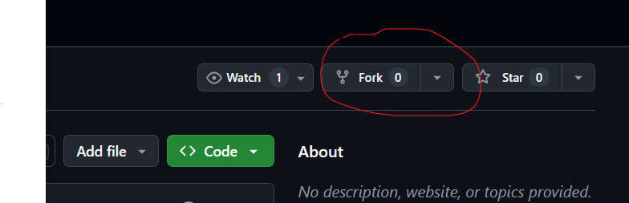
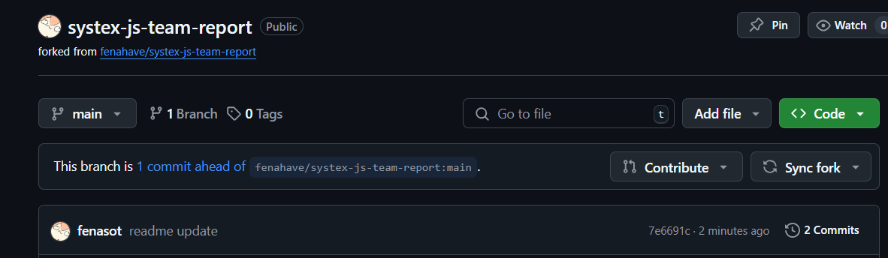
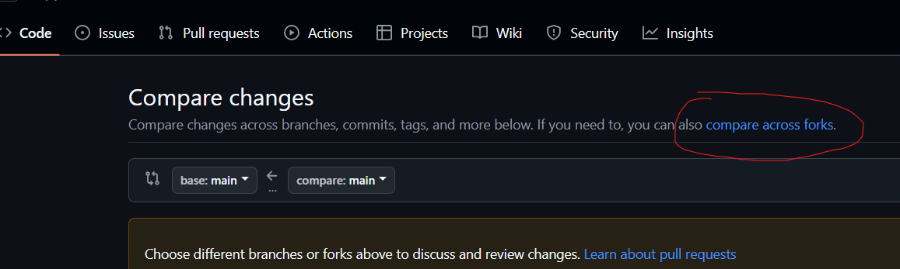
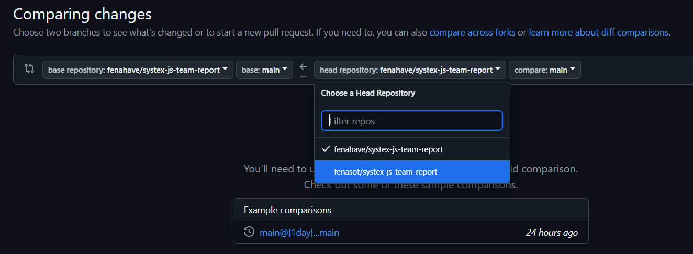
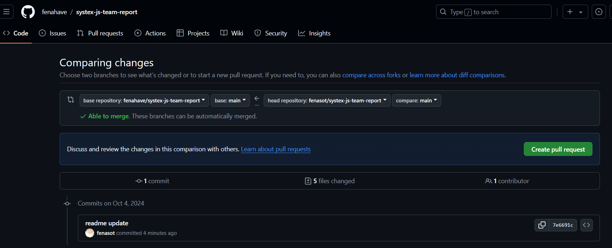

# 第一組作業報告

## 文件

1. style.css 用來當所有頁面的統一規格
2. 個別的設定請建立自己的css檔並引入，或直接寫在自己的文檔內
3. code區塊可引入run_pprettify.js 用並用下方代碼直接套用樣式即可(黑暗模式可引入pretty.css)
```html
<script src="../js/13/run_pprettify.js"></script>
<link rel="stylesheet" href="../css/pretty.css" />
```
```html
<pre class="prettyprint">
codes
</pre>
```

## Github 推送操作

1.  `Fork` 此專案到你的 GitHub 帳號. <p>



2. `clone` 自己的專案到本地

3. `commit` 並 `push` 後，github上自己帳號上應該會長這樣<p>



4. 這時候，回到原本的專案，點`Pull requqest` => `New pull request` => `compare across forks` => `選擇分支(左方為主分支，右方選自己的分支)` => `create pull request` ，就可提交 `pull` 的請求




